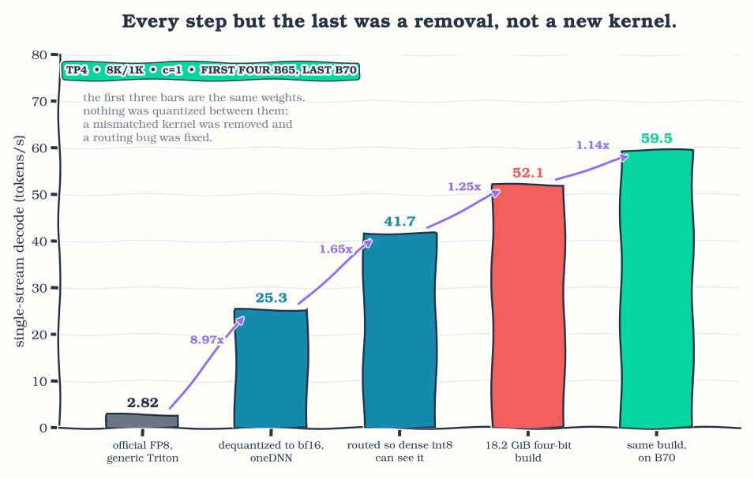
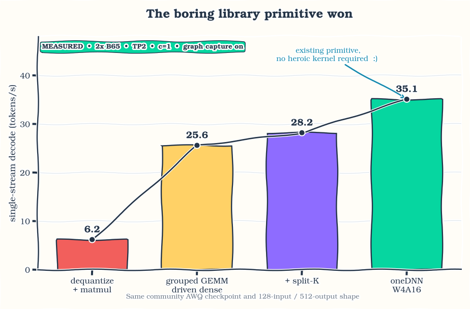
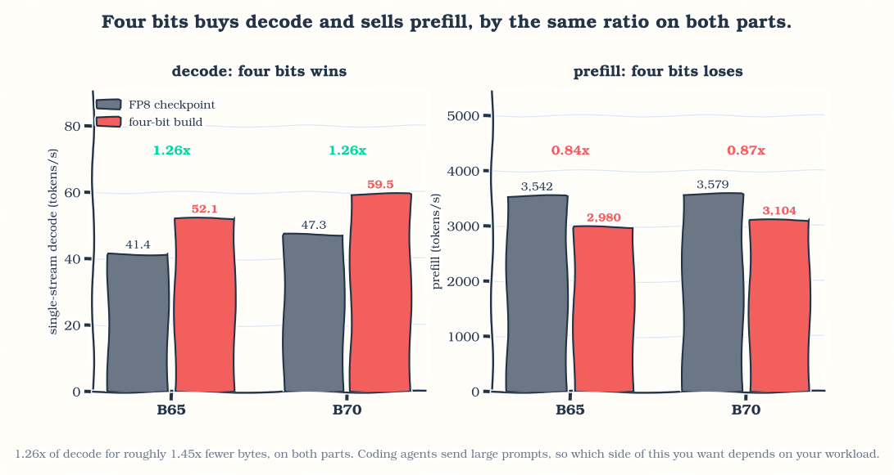
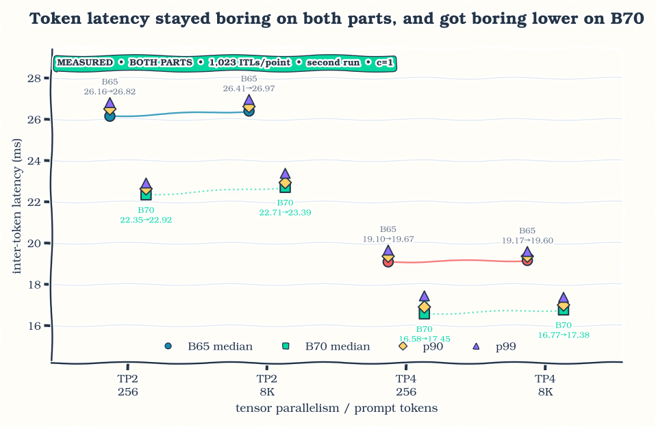
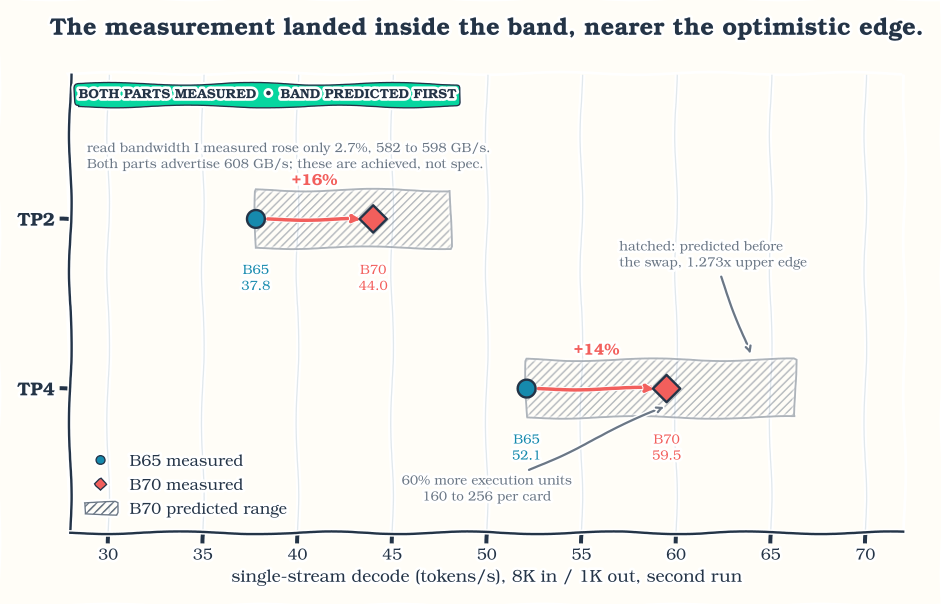
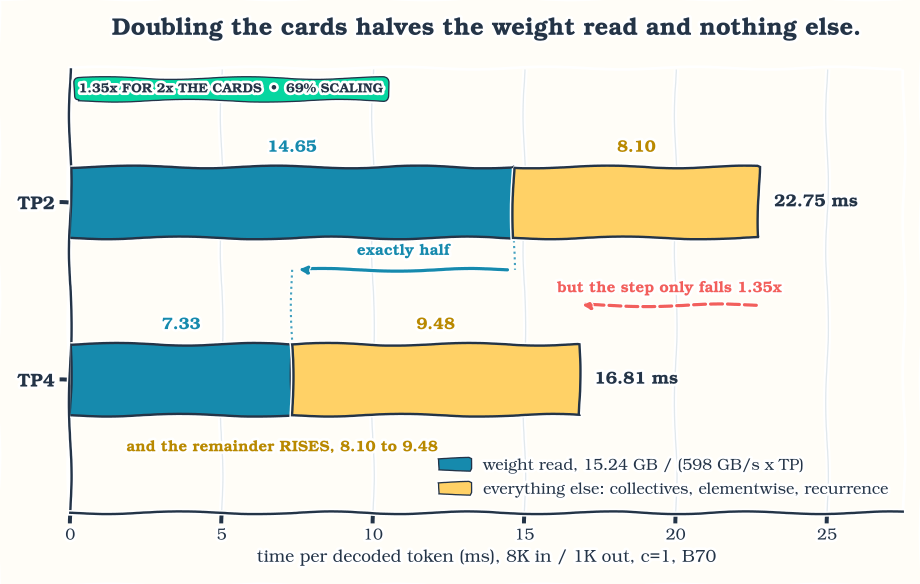
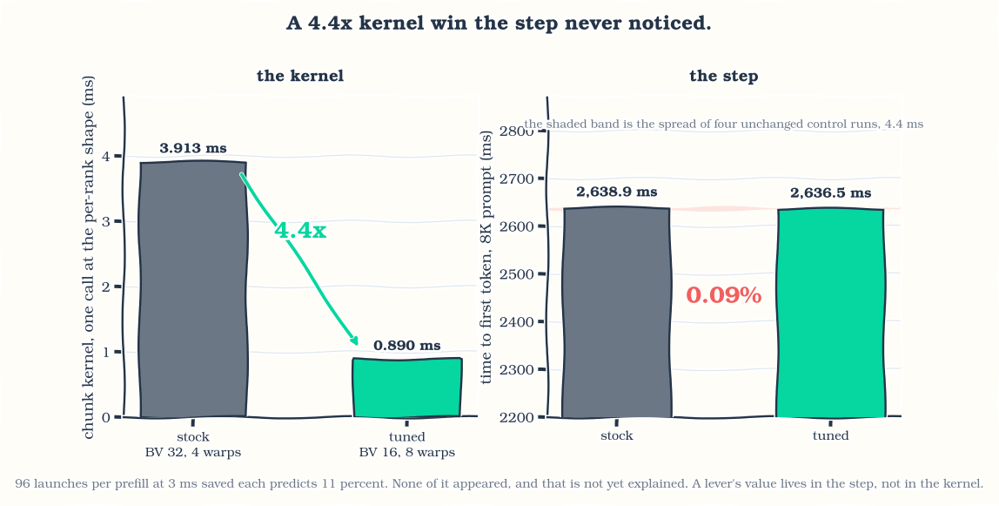

The official Qwen3.8-27B FP8 checkpoint decoded at **2.82 tokens per second** on
four Intel Arc Pro B65 cards the first time I ran it. It now runs at **59.5
tok/s** on four B70s as an 18.2 GiB four-bit build of my own. Almost none of that
came from writing a kernel. Most of it came from removing one that should never
have been running, fixing a routing bug that made a fast path invisible, and
choosing a quantization group size.

Along the way the same build reaches **37.8 tok/s on two B65 cards**, against
41.4 for the official checkpoint on four. Halving the hardware is the result I
care about most, because it is the one that changed what I can actually run at
my desk.

I wanted [Qwen3.8-27B](https://huggingface.co/Qwen/Qwen3.8-27B) as the local
backend for coding agents: good at code, useful at long context, small enough to
run on a few GPUs. Local agents make latency personal. A slow token is not a
number in a benchmark, it is an interruption while you are editing a file,
searching a repository, or waiting on a tool call.

Getting there took longer than expected. The model is dense, multimodal, and
mostly built from Gated DeltaNet layers. It has a multi-token-prediction head, a
vision tower, and enough different execution regimes that a change which looks
great in a standalone kernel can vanish, or turn into a regression, once it is
inside the server.

None of what worked was dramatic. The largest four-bit step came from a library
primitive that already existed. Group size 128 beat group size 32. A cost
I had written off as fixed host overhead turned out to be dense device work. And
the 48 DeltaNet layers I expected to dominate decode were not where most of the
time went.

This is independent work I did in my free time on hardware available to me. It is
not an Intel release or an official Intel performance result. Intel XPU support
has been arriving quickly in SGLang and the surrounding stack, so the job here
was to optimize this particular model and add the model-specific pieces missing
from the version I used. Before applying anything described below, check whether
current upstream already has it.

## Running it

If you only want the model serving, this is the setup I use daily: four Arc Pro
cards at tensor parallelism 4, the model's full 256K context, and room for
several requests in flight at once. A single stream decodes at 52.1 tok/s on an
8K prompt on B65 and 59.5 on B70, and token-to-token latency stays flat as the
context fills. At eight concurrent streams on B70 the server holds 47.6 tok/s per
stream, 381 aggregate.

The weights are at
[`ulkaa/Qwen3.8-27B-AWQ-INT4`](https://huggingface.co/ulkaa/Qwen3.8-27B-AWQ-INT4)
and the pinned serving image is on Docker Hub as
[`rahulunair/sglang-xpu`](https://hub.docker.com/r/rahulunair/sglang-xpu),
tag `qwen3.8-27b-20260816`.

```bash
docker run --rm --device=/dev/dri -v /dev/dri:/dev/dri \
  --group-add video --group-add "$(getent group render | cut -d: -f3)" \
  --cap-add=SYS_PTRACE --security-opt seccomp=unconfined \
  --ipc=host --shm-size=64g --ulimit memlock=-1 \
  -p 30000:30000 -v /path/to/Qwen3.8-27B-AWQ-INT4:/model:ro \
  -e ONEAPI_DEVICE_SELECTOR=level_zero:gpu \
  rahulunair/sglang-xpu:qwen3.8-27b-20260816 \
  python -m sglang.launch_server --model-path /model --device xpu \
    --tp-size 4 --attention-backend intel_xpu --page-size 64 \
    --context-length 262144 \
    --chunked-prefill-size 4096 --mem-fraction-static 0.85 \
    --cuda-graph-config '{"decode":{"backend":"full","bs":[1,2,4,8]},"prefill":{"backend":"disabled"}}'
```

Use `--tp-size 2` on a two-card machine, where the same prompt decodes at 37.8
tok/s on B65 and 44.0 on B70. Leaving `--max-total-tokens` unset lets the server size the KV pool from
the memory it finds; pin it lower if you are sharing the cards with something
else. The `SYS_PTRACE` and unconfined seccomp flags are there for one optional
fast collective I describe later; drop both and the model still runs normally.

Do check current upstream SGLang and Intel images before reaching for a pinned
image. A pinned release is useful for reproducing this article; it is not a reason
to keep that patch set around forever.

The rest of this post is how I got there.

## What are we actually running?

Qwen3.8-27B has 64 decoder layers. Forty-eight use Gated DeltaNet, a linear
attention recurrence, and 16 use full attention. It is dense rather than
mixture-of-experts, so almost every large text-model weight participates in every
decode step. The checkpoint also carries a 27-layer vision tower and a
multi-token-prediction head.

That shape splits the problem into two regimes:

- **Decode at batch one** has very little arithmetic reuse. It is mostly a
  question of how many bytes must cross memory for every new token, plus small
  kernels, layer boundaries, and collectives.
- **Prefill** turns the same projections into larger matrix operations and adds
  context-growing attention work. Compute throughput and tile efficiency matter
  much more here.

I kept two checkpoints working throughout.

1. The official [Qwen3.8-27B-FP8](https://huggingface.co/Qwen/Qwen3.8-27B-FP8)
   checkpoint, my reference while getting everything working.
2. My [Qwen3.8-27B AWQ W4A16](https://huggingface.co/ulkaa/Qwen3.8-27B-AWQ-INT4)
   checkpoint: 18.2 GiB, asymmetric group-128 quantization, BF16 vision tower and
   MTP tensors preserved.

"FP8 model" and "AWQ model" describe how a checkpoint stores its weights, not
necessarily the instruction that runs every projection. The runtime may
dequantize into BF16, keep an extra signed-INT8 copy for decode, or dispatch an
actual four-bit primitive. Keeping storage precision, activation precision, and
selected kernel separate in my head avoided a lot of confusion.

These are the final runs. Output was coherent, graph replay and the expected fast
paths were active, and I used the second run of each shape. Earlier numbers
helped me debug the model but are not useful baselines. Where I say decode
tok/s I mean `1000 / TPOT`, not the benchmark's output-throughput field, which
folds time-to-first-token into the same interval and reads lower.

| model and setup | GPUs / TP | input / output | TTFT | prefill, TTFT-derived | TPOT | decode |
|---|---:|---:|---:|---:|---:|---:|
| official FP8, optimized dense decode setup | 4x B65 / TP4 | 8K / 1K | 2,313 ms | 3,542 tok/s | 24.17 ms | **41.4 tok/s** |
| AWQ group 128, oneDNN W4A16 | 2x B65 / TP2 | 8K / 1K | 4,479 ms | 1,829 tok/s | 26.44 ms | **37.8 tok/s** |
| AWQ group 128, oneDNN W4A16 | 4x B65 / TP4 | 8K / 1K | 2,749 ms | 2,980 tok/s | 19.20 ms | **52.1 tok/s** |
| AWQ group 128, oneDNN W4A16 | 2x B70 / TP2 | 8K / 1K | 3,437 ms | 2,384 tok/s | 22.75 ms | **44.0 tok/s** |
| AWQ group 128, oneDNN W4A16 | 4x B70 / TP4 | 8K / 1K | 2,639 ms | 3,104 tok/s | 16.81 ms | **59.5 tok/s** |

*These are complete setups, not a one-change-at-a-time comparison: graph capture
on, concurrency 1, second run, roughly 9K context at the end of decode.*

The first two rows are the ones I keep coming back to. Two cards running my
four-bit build land at 37.8 tok/s against 41.4 for the official checkpoint on
four. The two rows use different checkpoint formats and different code
paths, so an efficiency percentage between them would mean very little. What it
does tell me is what this workload costs in hardware: two cards now give me the
interactive feel I was getting from four.

The official FP8 checkpoint stays useful. It is the standard model, it works in
the release image, and it helped me separate real model behaviour from bugs in
my own quantization pipeline.

## Before writing a kernel, do the boring math

The first question about any operator is whether it is limited by arithmetic or
by memory traffic:

```text
time >= max(useful_FLOPs / achievable_FLOPs_per_second,
            bytes_moved / achievable_bytes_per_second)
```

For batch-one dense decode, arithmetic intensity is close to one operation per
weight byte. The memory term wins quickly, so the first useful model is just
counting bytes:

```text
bytes_per_token = sum(weights and metadata read by one decode step)
seconds_per_token = bytes_per_token / aggregate_achievable_bandwidth
tokens_per_second = 1 / seconds_per_token
```

Count from the `safetensors` headers, not from a number in `config.json`. An
embedding table is resident but only one row gets looked up. The vision tower is
resident but idle during a text-only turn. The MTP head is only read when
speculation is active. On a multimodal model, counting every resident tensor can
add several GiB the step never actually reads.

Quantization metadata counts too. A nominal four-bit weight with group scales and
zero points is not exactly 0.5 bytes per parameter. In this format it is about
0.52 bytes at group 128 and about 0.59 at group 32, and that metadata is read
alongside the payload on every token.

Prefill is a different calculation. A reasonable first approximation for the
dense projections is `2 × parameters × prompt_tokens` floating-point operations,
with the attention term added separately. This is why one number called "model
throughput" should never be used for both phases.

Intel lists both the B65 and the B70 at 32 GiB and 608 GB/s of memory bandwidth.
The B65 has 20 Xe2 cores and 197 peak dense INT8 TOPS; the B70 has 32 cores and
367 TOPS. Same advertised bandwidth, roughly 1.86x the INT8 compute. Decode and
prefill should therefore scale differently even before software enters the
picture.

A roofline gives you a boundary. Mostly I use it as a warning system: it tells me
when a proposed optimization cannot possibly repay its complexity, when a
measurement looks suspiciously good, and when writing another kernel is unlikely
to be worth the time.

## Check upstream first, then add the missing bits

Pinned containers are good for reproducibility, and they also freeze the stack at
one moment. The XPU stack kept moving while I worked, so my loop for every
missing path became:

1. Check current SGLang, torch-xpu, oneDNN, Intel's images, and the XPU kernel
   packages.
2. Confirm whether the failure is still present in the pinned release.
3. Separate a missing platform-specific branch from a missing implementation.
4. Add the smallest overlay that makes the model correct.
5. Delete the overlay when upstream covers the same case.

Step three is the one that saves weeks, and it came up immediately.

SGLang reads AWQ checkpoints through a component called `compressed-tensors`,
which decides how packed four-bit weights get unpacked and which matrix kernel
serves them. In the version I was using, two small things assumed an
NVIDIA GPU. A helper that rearranges packed weights into the layout the kernel
expects was imported only when CUDA was available, then called later regardless.
Separately, the code that picks a quantization scheme asked CUDA for the device's
compute capability before it had chosen a scheme at all, which fails on a
machine with no CUDA device.

Neither of those means Intel GPUs lack a four-bit kernel. The kernel was there.
The checkpoint just could not reach it, because the road to it ran through
NVIDIA-only code. Adding the missing branch was enough.

The MTP path had the same shape. I registered the XPU attention backend in the
speculative draft maps, routed the token-tree convolution to a Triton
implementation that accepts tree arguments, and relaxed two helpers that rejected
non-CUDA tensors even though their implementation was already Triton. Small
integration fixes, not a replacement serving stack.

One more lesson: "the model loaded" is only the beginning of correctness. My
first text-only quantization build silently omitted the vision tower and the MTP
head. The library never instantiated an MTP module, so `save_pretrained` could
not save tensors it did not know existed. I now build with the multimodal class,
copy the MTP tensors explicitly, and verify the tensor list before any
performance run.

## The FP8 checkpoint was running the wrong kernel

The official FP8 checkpoint is where this started, and the first clean run of it
managed 2.82 tok/s on four B65 cards. That number is real, and it is not a
quantization problem. It was one missing branch, one fact about the hardware, and
one routing bug.

{fig-alt="Decode rises from 2.82 tokens per second on the official FP8 checkpoint through 25.3 and 41.7 to 52.1 on the four-bit build and 59.5 on B70." width=100%}

*Figure 1. The first three bars are the same weights. Nothing was quantized between them; a mismatched kernel was removed and a routing bug was fixed.*

| dense path, B65 TP4 | TPOT | decode |
|---|---:|---:|
| FP8 block, generic Triton | ~354 ms | 2.82 tok/s |
| dequantized to BF16, oneDNN | 39.50 ms | 25.3 tok/s |
| the same, plus dense INT8 | **23.99 ms** | **41.7 tok/s** |

**The missing branch.** `_dispatch_auto_backend()` in `fp8_utils.py` has no XPU
arm. Block-FP8 falls past DeepGEMM, FlashInfer, CUTLASS and AITER and lands on
the generic Triton `w8a8_block_fp8_matmul`. Every dense projection in a dense 27B
model was running an untuned kernel written for other hardware.

**The hardware fact.** Xe2 has no native FP8 matrix path. The systolic array does
FP16, BF16 and INT8. FP8 buys memory traffic and pays it back in conversion, so
the fix was not to tune that kernel but to stop using it: fold the block scale in
at load time and serve the result as a plain BF16 linear through oneDNN. That is
2.82 to 25.3.

**The routing bug**, which is the part worth telling. The BF16 arm returned
`torch.nn.functional.linear` straight out of `Fp8LinearMethod.apply`, while every
XPU dense fast path binds `UnquantizedLinearMethod.apply`. The dequantized layers
were invisible to all of them, so dense INT8, which the image enables by default,
had been declining every single tensor:

```text
before   served   0.000 GB   declined  8.753 GB   served fraction  0.0%
after    served 121.635 GB   declined 38.549 GB   served fraction 75.9%
```

Had I A/B tested dense INT8 in that state I would have measured nothing and
concluded the INT8 lever does not transfer to this model. The fix is also the
truer description of the arm: once the block scale is folded in, the weight is an
unquantized BF16 linear, so the unquantized method should be the one serving it.
That is 25.3 to 41.7, and 14.8x in total without writing a kernel.

One trap on the way out. The logprob gate reported the BF16 and INT8 arms
identical to four decimal places, which reads like INT8 being lossless. It is
not. Input logprobs are computed during prefill, where the INT8 path declines
because M is the prompt length and its `max_m` is 4. The metric is structurally
blind to a decode-only change. Comparing generated text instead, which can see
it: three of four prompts identical, the fourth diverging at character 97 into a
different but equally coherent continuation, which is a near-tie logit flipping
under greedy decode.

## The existing library primitive was the fastest kernel I tested

Once the model was correct enough to benchmark, the obvious question was which
four-bit matrix path should serve the dense projections.

The answer was not my hand-driven kernel. On the same community AWQ checkpoint,
[`barrydeen/Qwen3.8-27B-AWQ-4bit`](https://huggingface.co/barrydeen/Qwen3.8-27B-AWQ-4bit),
the same two B65 cards, and the same captured 128-input/512-output shape:

{fig-alt="Four measured W4A16 paths on two B65 cards rise from 6.2 tokens per second for separate dequantization and matmul to 35.1 tokens per second for the existing oneDNN primitive." width=100%}

*Figure 2. The existing oneDNN primitive, not a new custom kernel, produced the largest measured four-bit step on this shape.*

| path | TPOT | decode |
|---|---:|---:|
| `awq_dequantize` followed by `torch.matmul` | 161.22 ms | 6.2 tok/s |
| `moe_grouped_mm_nt_xe20_w4a16`, driven as a dense GEMM | 39.04 ms | 25.6 tok/s |
| the same kernel with split-K | 35.44 ms | 28.2 tok/s |
| `aten::_weight_int4pack_mm_with_scales_and_zeros` / oneDNN | **28.46 ms** | **35.1 tok/s** |

That ATen primitive dispatches to oneDNN weight decompression. It needed no
model-specific tuning file and, for this checkpoint layout, no second weight
repack. Reading its source also explained a BF16/F16 difference I had measured:
the specialized four-bit dequantization path in the oneDNN version I used only
accepts F16 and F32 compute types, so BF16 falls through to a more generic
tile-conversion branch.

I spent a day pushing the hand-driven path before accepting the stop condition:
if the library primitive is already close to the in-situ roofline, keep it as the
baseline and move up a level. oneDNN wins this round.

That was a large improvement, and it exposed the next problem. The community AWQ
checkpoint left the three large Gated DeltaNet projections in BF16, and those
represented nearly half the bytes read during a decode step. The kernel was no
longer the only question. The checkpoint itself had become part of the latency
path.

## Four bits is not really four bits

My checkpoint inventory measured the three large projections in every DeltaNet
layer (input QKV, input Z, and output) at roughly 10.36 GiB in BF16. That is
about 47% of the community checkpoint's decode traffic. I nearly left them alone.
Then I looked at the official FP8 release and found scale tensors for those same
projections, with only the small surrounding tensors excluded. Useful prior: the
model authors quantize these in their own low-precision release.

My AWQ build quantizes 24.33 billion parameters with asymmetric group-128 W4A16.
Per-group scales and zero points bring the stored cost of those weights to 4.16
bits per parameter. Another 3.45 billion parameters stay BF16: embeddings, output
head, norms, small DeltaNet gates, vision tower, and MTP head. Across the full
checkpoint that averages 5.63 bits per parameter, or 18.2 GiB.

I did not arrive at group 128 immediately. The first all-four-bit build used group
32. It had finer quantization groups and fewer total model bytes than the
community checkpoint, and it ran slower. Two measurements explained the sign:

- Group 32 reads four times as many scale and zero-point groups.
- On the same `down_proj` tensor at `M=1`, oneDNN moved group-32 data at 383 GB/s
  and group-128 data at 505 GB/s. The matching BF16 GEMV reached 589 GB/s.

Group size turned out to be a serving-layout decision as much as a quality
setting, and re-quantizing at 128 was worth more than another day of kernel
changes.

Here the comparison is like for like: same cards, same TP2 setup, same
128-input/512-output shape, same server, two four-bit checkpoints of the same
model. Quantizing the DeltaNet projections cut measured decode
traffic from 21.82 GiB to 14.19 GiB, about 35%, and throughput moved from 35.4 to
38.5 tok/s.

| TP2, 128/512 shape | bytes read per step | TPOT | decode |
|---|---:|---:|---:|
| [`barrydeen/Qwen3.8-27B-AWQ-4bit`](https://huggingface.co/barrydeen/Qwen3.8-27B-AWQ-4bit), DeltaNet projections BF16 | 21.82 GiB | 28.24 ms | 35.4 tok/s |
| [`ulkaa/Qwen3.8-27B-AWQ-INT4`](https://huggingface.co/ulkaa/Qwen3.8-27B-AWQ-INT4), group 128, DeltaNet projections INT4 | **14.19 GiB** | **25.95 ms** | **38.5 tok/s** |

*About 9% faster than the community four-bit checkpoint. Thirty-five percent
fewer bytes bought about nine percent more tokens per second, so the byte model
found the opportunity, but those newly quantized projection shapes were clearly
behaving unlike ordinary dense four-bit GEMMs.*

Thirty-five percent fewer bytes and nine percent more tokens is not the ratio a
bandwidth model predicts. I spent a long time assuming I had lost a saving
somewhere inside the merged DeltaNet projection. The last section is where that
gets settled, and not in the direction I expected.

## Four bits buys decode and sells prefill

Quantizing to four bits is a trade, and it is worth stating in both directions.

{fig-alt="Side by side bars: the four-bit build wins decode by 1.26x on both B65 and B70, and loses prefill, running at 0.84x and 0.87x of the FP8 checkpoint." width=100%}

*Figure 3. The same 1.26x decode gain on both parts, and the same prefill cost.*

| TP4, 8K / 1K, c=1 | B65 | B70 |
|---|---:|---:|
| FP8 decode | 41.4 tok/s | 47.3 tok/s |
| four-bit decode | **52.1 tok/s** | **59.5 tok/s** |
| decode ratio | 1.259x | 1.257x |
| FP8 prefill | 3,542 tok/s | 3,579 tok/s |
| four-bit prefill | 2,980 tok/s | 3,104 tok/s |
| prefill ratio | 0.84x | 0.87x |

Four bits removes roughly 1.45x the bytes and returns 1.26x the decode, and it
returns the same 1.26x after a change of silicon. Coding agents send large
prompts, so giving up about 16% of prefill to gain about 26% of decode is a
choice to make deliberately rather than by default.

That constant 1.26x against a 1.45x byte saving looked like a general per-byte
cost somewhere in four-bit decompression, so I ran concurrency 8 expecting the
advantage to shrink. Dequantization work grows with M while the weight-side
saving does not, and the usual expectation is a batch size where FP8 wins
outright. It went the other way:

| B70 TP4, 8K / 1K, c=8 | FP8 | four-bit |
|---|---:|---:|
| TPOT | 30.54 ms | **20.99 ms** |
| per stream | 32.7 tok/s | **47.6 tok/s** |
| aggregate | 262.0 tok/s | **381.1 tok/s** |

That is 1.455x, essentially the full byte ratio. Read from the other side, going
from one stream to eight costs FP8 9.41 ms per token and the four-bit build 4.18
ms, so FP8 degrades about twice as fast with batch. That fits Xe2 having no FP8
matrix path: conversion work scales with activations, and activations grow with
batch, while the weight-side saving does not.

So the shortfall against the byte ratio is a concurrency-1 effect rather than a
fixed property of four-bit decode. At one stream the step has slack the byte
model cannot see. At eight, the bytes convert almost in full. (The c=8 TTFT is a
queueing figure with eight requests contending, not a prefill rate, so it does
not belong next to the c=1 prefill numbers.)

## Graph capture changes both performance and observability

Decode is a long chain of small operations. Graph replay removes much of the
per-operation submission cost, so graph capture is part of the setup I actually
use, not an optional benchmark trick. Earlier work on two other models in this
series measured it as a first-order improvement. For Qwen3.8 I do not have a
clean graph-on/graph-off comparison, so I attach no new percentage to it.

Capture also changes what instrumentation means. A Python-side counter that gets
incremented while the graph is being captured can replay the device work forever
without ever incrementing the Python value again. I once had a fast collective
serving happily inside the graph while its own log insisted `served=0`.

The only trustworthy proof was controlled removal:

- build the same graph with the path enabled;
- build it again with exactly that path disabled;
- run the same shape after compilation;
- require the timing to move by more than the quiet-box noise floor.

One of those A/B tests was for a small collective operation. When the model is
split across four cards, every layer has to sum partial results from all of them,
an operation called an all-reduce. During decode that message is tiny: one token
at hidden size 5,120 in BF16 is about 10 KiB. At that size almost none of the
time goes into moving bytes. It goes into the fixed cost of setting up the
exchange and getting the cards to agree they are ready.

So a leaner path for small messages is worth having. The one I use is built on
shared memory that the rank processes map directly, capped at 64 KiB, handing
anything larger (prefill, mostly) back to the standard collective. Disabling it
in the saved TP4 A/B run cost 4.41 ms per step.

Because it maps shared-memory handles across those processes, it needs
`SYS_PTRACE` and `seccomp=unconfined` in my container. Those permissions widen
what the container can do. They are required for this optional collective, not
for running Qwen3.8 in general, so remove them and disable the path if that
tradeoff does not suit you.

Hybrid models have another memory pool to watch. The recurrent state pool competes
with the KV cache and can bound concurrency before the ordinary request limit
does. I once configured it below the number of slots a single request needs and
got a server reporting zero runnable requests, with an error that mostly talked
about memory. Raising the request limit was never going to help. There was
nowhere to put the recurrent state.

## The trace blamed the wrong component

At one point I fit TP2 and TP4 measurements to a simple model with a sharded
weight term and a constant term. The fit suggested roughly 12 ms that did not
shrink with more cards. Host overhead or graph replay looked guilty.

Rather than apportion a busy trace, I priced components by removal on the real
captured graph. Replace one component with shape-matched zeros, keep the rest of
the graph and the collectives intact, and measure against an unchanged repeat.
This does not produce a perfect additive profile, since collectives overlap some
module rows, but it answers the causal question: what disappears if this
component is removed?

Starting from a 28.59 ms B65 TP2 run:

| removed component | measured cost | share of the step |
|---|---:|---:|
| dense MLP bodies across 64 layers | **12.37 ms** | **43% measured** |
| attention sublayers across 64 layers | **10.39 ms** | **36% measured** |
| of which attention and GDN kernels | 2.24 ms | 8% measured |
| of which projections, gates, RoPE, and collectives | 8.15 ms | 28% measured |
| layer-stack all-reduces, overlapping the rows above | 3.82 ms | 13% measured |
| sampling path | 0.37 ms | 1% measured |

The supposedly fixed host term was mostly dense MLP device work, whose poor
multi-card scaling made a two-point fit look constant. The DeltaNet recurrence
itself was small. Had I trusted the fit, I would probably have spent another week
optimizing the wrong layer family.

That changed the order of future work: merged four-bit projection shapes first,
then dense scaling, then whatever a fresh removal budget turns up. The recurrence
is not free, but it is not the first problem.

## The final latency distribution is pleasantly boring

A mean TPOT can hide an ugly tail, so I measured the inter-token latency
distribution for the final AWQ release. Each point below summarizes 1,023
inter-token intervals from the second run of a 1,024-token output, concurrency
one, graph capture on.

{fig-alt="Median-to-p99 inter-token latency stays narrow across eight cells: two and four cards, B65 and B70, at short and 8K prompts. Every range is under 0.7 ms wide." width=100%}

*Figure 4. Every median-to-p99 range is under 0.7 ms wide, on both parts.*

| TP | prompt | B65 median → p99 | B70 median → p99 |
|---|---:|---:|---:|
| TP2 | 256 | 26.16 → 26.82 ms | 22.35 → 22.92 ms |
| TP2 | 8K | 26.41 → 26.97 ms | 22.71 → 23.39 ms |
| TP4 | 256 | 19.10 → 19.67 ms | 16.58 → 17.45 ms |
| TP4 | 8K | 19.17 → 19.60 ms | 16.77 → 17.38 ms |

This is the kind of graph I like: not dramatic, just steady. It supports a more
useful statement than "the model does 52 tok/s". At these contexts and this
concurrency the ordinary token-to-token experience hides no large tail, and the
distribution is as boring on B70 as on B65, just lower.

## What B70 actually did

I published a predicted range for B70 rather than a measurement, then swapped the
cards and measured it. The prediction is worth keeping because one half of it was
wrong in an interesting way.

{fig-alt="Measured B65 and B70 decode plotted inside the predicted band: TP2 rises 37.8 to 44.0 tokens per second, TP4 rises 52.1 to 59.5, both landing nearer the optimistic edge." width=100%}

*Figure 5. Both measurements landed inside the band I predicted, nearer its optimistic edge.*

| | B65 | B70 | change |
|---|---:|---:|---:|
| read bandwidth, measured | 582 GB/s | 598 GB/s | +2.7% |
| TP2 decode, 8K / 1K | 37.8 tok/s | 44.0 tok/s | **+16%** |
| TP4 decode, 8K / 1K | 52.1 tok/s | 59.5 tok/s | **+14%** |
| TP2 prefill | 1,832 tok/s | 2,384 tok/s | +30% |
| TP4 prefill | 2,980 tok/s | 3,104 tok/s | +4% |

The conservative edge of my range said decode would be flat, because both parts
advertise the same bandwidth and batch-one decode is supposed to be bandwidth
bound. It measured +14 to +16 percent. After seeing TP2 I predicted 58 to 61 at
TP4 and it came in at 59.5.

Bandwidth rose 2.7 percent, decode rose 14 to 16, and the two parts differ by 60
percent more execution units, 160 against 256. Decode on this model is therefore
not purely bandwidth bound, which is the useful thing the swap taught me.

The same point shows up in how badly TP4 scales over TP2:

{fig-alt="Stacked bars: the weight-read term halves exactly from 14.65 to 7.33 ms between TP2 and TP4, while everything else rises from 8.10 to 9.48 ms, so the step falls only 1.35x." width=100%}

*Figure 6. The weight read halves exactly. Everything else rises.*

| B70, 8K / 1K, c=1 | TP2 | TP4 |
|---|---:|---:|
| TPOT | 22.75 ms | 16.81 ms |
| weight read, 15.24 GB over the cards at 598 GB/s each | 14.65 ms | 7.33 ms |
| everything else | 8.10 ms | 9.48 ms |

The weight term halves exactly, as bandwidth-bound decode must. The remainder
does not fall at all, it rises. That is why doubling the cards buys 1.35x on B70
and 1.38x on B65 instead of 2x, and that 9.48 ms is the largest single thing
standing between 59.5 tok/s and the 157 tok/s TP4 roofline. At 38 percent of that
ceiling, what is left is a factor of two, not an order of magnitude.

## A 4.4x kernel win the step never noticed

Since the thesis here is about method, a clean negative result belongs in it.

I built a successive-halving tuner for the Gated DeltaNet chunk kernel over the
Xe2 configuration space, with a measured noise floor and a refusal to promote any
winner inside it. It found one: 3.91 ms down to 0.89 ms, 4.4x, at the exact
per-rank shape the server launches. (Hg=4, H=12 at TP4, not the full-model
geometry. I tuned the wrong shape first and had to redo it.)

{fig-alt="The chunk kernel drops 4.4x from 3.913 to 0.890 milliseconds, while time to first token moves 0.09 percent, from 2638.9 to 2636.5 milliseconds, inside the control spread." width=100%}

*Figure 7. A 4.4x kernel win, and a 0.09% change in the thing I actually care about.*

End to end it was worth nothing. TTFT was 2,638.9 ms stock against 2,636.5 ms
tuned, inside a 4.4 ms control spread established across four server starts. The
kernel is confirmed reachable, selected and executed, and 96 launches per 8K
prefill at 3 ms saved each predicts 11 percent. None of it appeared, and I cannot
yet explain where it went.

What I can explain is why the lever was small to start with. On the two earlier
hybrid models the tuned kernel was the MoE grouped GEMM: dominant, on the decode
path, with a real configuration space and no tuned file for those shapes. All
three of those conditions fail here. Qwen3.8 is dense, so there is no MoE. The
kernel I tuned sits on the prefill path, and prefill was already past target. And
this model's hot decode kernel is a oneDNN library call with no `num_warps` to
sweep. The one Triton decode kernel that did have a configuration space had
already been retiled 32 to 16 on BV, and that gain is inside the 59.5 rather than
sitting on top of it.

The transferable part is not that tuning does not work. It is that a lever's
value lives in the step, not in the kernel.

## A quick detour through the other models

Qwen3.8 was the fourth model in this line of work. The earlier three are not
apples-to-apples competitors, since they use different architectures, card
counts, TP sizes, and workloads. Their value here is showing which methods
survived contact with another model.

| model | one useful result | what I brought forward |
|---|---|---|
| [Qwen3-Coder-Next 80B-A3B](https://huggingface.co/Qwen/Qwen3-Coder-Next) | **100.9 tok/s**, B70 TP4, 8K/1K c=1 | graph replay, TP-specific tuning, small-collective latency, counting the weights actually used per token |
| [Ornith 1.0 35B](https://huggingface.co/ornith-ai/Ornith-1.0-35B) | **106.8 tok/s**, B70 TP2, 8K/1K c=1 | check packed quantization against real tensors, and never assume a Qwen attention setting helps another hybrid model |
| [DeepSeek-V4-Flash](https://huggingface.co/deepseek-ai/DeepSeek-V4-Flash-0731) | **35.1 tok/s** short-context decode and 2,355 tok/s at 8K prefill on 8x B70; a later single-stream test fit 801,024 usable tokens at a 1M setting | start with upstream, measure cold prefill separately, remove components to find where the time really goes |

The most useful warning came from Ornith. It looked similar to Qwen: hybrid
attention, Gated DeltaNet, packed four-bit experts. Yet its asymmetric zero points
changed the correctness contract, its router already used a good XPU top-k path,
and the Qwen attention override made it slower. The method transferred; the
configuration did not.

Those rows are reference points, not a competition between models. Each one
deserves its own post, and I plan to write them. This one is about Qwen3.8 and
the method I used to work out what it needed.

That is also why I do not present a bag of "Xe2 optimizations" to enable all at
once. Graph capture, rooflines, proof that a fast path actually ran, and
controlled A/Bs are methods. A tile size, context cutoff, or packed layout belongs
to the exact model, card, and TP combination that earned it.

## What were Codex and Claude actually useful for?

I used coding agents extensively during this work, mainly Codex and Claude. They
were useful in a narrower and more practical way than "the agents wrote the
optimization".

- **Reading an unreasonable amount of source.** One investigation followed the
  SYCL grouped GEMM through its tile policy and reorder atoms, then compared it
  against oneDNN. That is how I learned the clever four-bit conversion I was about
  to implement already existed.
- **Surveying an API surface.** An agent enumerated quantized primitives with
  real XPU dispatch, their schemas, and their layout contracts, which quickly
  separated usable operators from names that merely sounded relevant.
- **Building harnesses from a strict specification.** The speculative-decoding
  harness refuses failed requests and keeps cache-sensitive natural-text tests
  separate from random-token kernel isolation.
- **Running serialized campaigns.** Tuning many shapes is boring but valuable,
  and it is a good background job when only one process may own the GPUs.

They were also entirely capable of producing a confident conclusion from an empty
log. Twice a container had stopped and the missing output was treated as a
finding. A `pkill -f` pattern matched the replacement command itself four times.
One benchmark reported a rejected over-context request as zeros, which looked
like an amazing performance result for a few seconds.

The fix belonged in the harness rather than the prompting: fail loudly, record
the exact setup and run number, keep retractions beside the results, and refuse
to print metrics for a rejected request. My own job stayed the same: one
benchmark on the GPUs at a time, one changed variable, and no number without a
saved log.

## Fast gibberish is still gibberish

Two quantization mistakes produced clean server starts and output consisting
almost entirely of exclamation marks.

First, the text-only model class changed module prefixes. Weight loading had a
name-translation layer, but the quantization ignore list did not, so exclusions
silently missed their targets.

Then the quantizer added the container module `layers.N.linear_attn` to the ignore
list, because the container itself was not a `Linear`. The runtime matched ignore
entries by substring, so that one entry hid every projection beneath it. Packed
tensors existed in the checkpoint and were never loaded into those linears.

Both cases now fail at build time, and I also compare packed dequantization
against an independent float64 reference on real tensors. Shape
checks alone are not enough. A wrong packed orientation can be shape-valid and
still produce fluent-looking, numerically wrong output.

The final group-128 AWQ checkpoint passed health, determinism, and coherence
checks on code, reasoning, factual, and summarization prompts. Against the BF16
reference:

| quality check | result |
|---|---:|
| mean rank of the BF16 reference token on aligned steps | **1.0000** |
| BF16 reference token outside AWQ top 8 | **0** |
| mean KL on aligned steps | 0.0201 |
| prefill perplexity | 8.87 → **9.33**, +5.2% |
| prompts whose greedy text diverged | 8 of 8 |
| aligned steps after divergence | 71 of 957 |

Exact argmax agreement applies only where the sequences are still aligned. Every
greedy sequence eventually diverged, leaving 7.4% of steps directly comparable.
So the claim stays modest: the quantized model tracks BF16 closely before
divergence, at a measured +0.46 prefill-perplexity cost. It is still a
four-bit model, not an exact BF16 drop-in.

I also have an absolute IFEval result, but no current BF16 run through the same
harness and scored subset, and I will not compare it against an older result that
skipped a different set of instruction types.

Multimodal inference works. The checkpoint keeps the vision tower in BF16, images
load, and the model answers questions about them. What I have not done is score
it against a broad image benchmark suite, so I can say the capability is present
and working without yet quantifying what the four-bit text weights cost it. The
MTP path is enabled as well, though acceptance rates and end-to-end benefit on
natural coding prompts still need a proper campaign. Random token IDs are useful
for defeating the prefix cache, but they pin speculative yield near its minimum
and cannot answer whether MTP helps a real session.

## The gap I went looking for was not there

The open question in the first version of this post was a missing saving.
Quantizing the DeltaNet projections removed 35% of the bytes read per decode step
and returned 9% more throughput. I said I would rather publish a result I could
not explain than tidy it up. Having measured it properly, the answer is that
there was nothing to find. The saving was never there to collect.

Three measurements closed it.

**The shape is not unusually slow.** Timing the weight-decompression matmul at
every real decode shape, per rank, at M=1:

| projection | K | N | int4 GB/s | bf16 GB/s |
|---|---:|---:|---:|---:|
| merged linear-attention input | 5120 | 8192 | 466 | 575 |
| feed forward gate_up | 5120 | 8704 | 502 | 562 |
| feed forward down | 8704 | 5120 | 541 | 583 |
| attention qkv | 5120 | 7168 | 427 | 573 |
| attention output | 2560 | 5120 | 445 | 649 |

My suspect shape is 7 to 14 percent slower per byte than the feed-forward shapes,
and redoing the arithmetic with these measured rates still predicts the full
6.5 ms.

**The path is taken.** Logging every distinct shape the first time it reaches the
quantized kernel showed both linear-attention projections present on both ranks.
Reachable, selected and executed all hold.

**The ablation was sitting in my own notes.** A build with those projections left
at 16 bit measured 28.24 ms against 25.95 ms for the four-bit build. They occupy
about 2.3 ms of the step, not the 9.7 ms their bytes imply.

So the model was wrong, not the build. A bandwidth model prices a weight at bytes
over bandwidth and assumes that time comes back when you shrink it. That only
holds while the weight read is the critical path for that stretch of the step. In
a hybrid recurrent architecture it frequently is not: the recurrence kernel, its
state traffic and the pointwise work around it are serialised with the projection
in every layer, and making the projection smaller leaves all of that untouched.

One reader worked backwards from my numbers to what the new projections must be
achieving, got roughly a third of peak, and called it a falsifiable prediction.
It was, and it is falsified. That shape measures 466 GB/s. The reasoning was
sound; the premise it rested on, that the removed BF16 traffic had been costing
what the byte model assigned it, was not.

I am leaving the original claim in the post above rather than quietly editing it
out. The byte model earned its place by finding the group-size problem and the
BF16 DeltaNet projections. It also over-promised here, and both halves are worth
knowing.

## Some of the things I want to do next

1. Diff the `ONEDNN_VERBOSE` implementation strings between a merged DeltaNet
   projection and a dense feed-forward projection at M=1. If the two shape
   families land on different impls, that is a configuration fix rather than a
   mystery.
2. Count reorders and copies around the QKVZ output, where a short convolution
   follows. A layout the convolution does not want would cost a copy
   proportional to the bytes I thought I had saved.
3. Measure tokens per second per watt. The argument for two cards over four is
   partly a power argument, and I have not put a number on it.
4. Work out how many concurrent sessions actually fit at 256K on two cards. With
   only 16 full-attention layers, that is the structural selling point of this
   architecture and I have not measured it.
5. Get the two `compressed-tensors` platform assumptions fixed upstream, so the
   next person hitting that wall does not have to rediscover them.
6. See how often MTP's speculated tokens are accepted in real coding-agent
   sessions instead of synthetic prompts.
7. Run a full multimodal suite so the vision path has numbers too.

What I would carry to the next model is the method rather than this
configuration: check upstream first, count bytes from the checkpoint, keep the
vendor library as the baseline, prove every fast path actually served, measure
with graph capture on because that is how the model will be used, and remember
what a byte model cannot see.

That is slower than collecting one exciting number, but it made the next model
much faster to understand. And Qwen3.8 is now a local coding-agent backend I can
use without thinking about every token it generates, which is what I wanted from
it.
