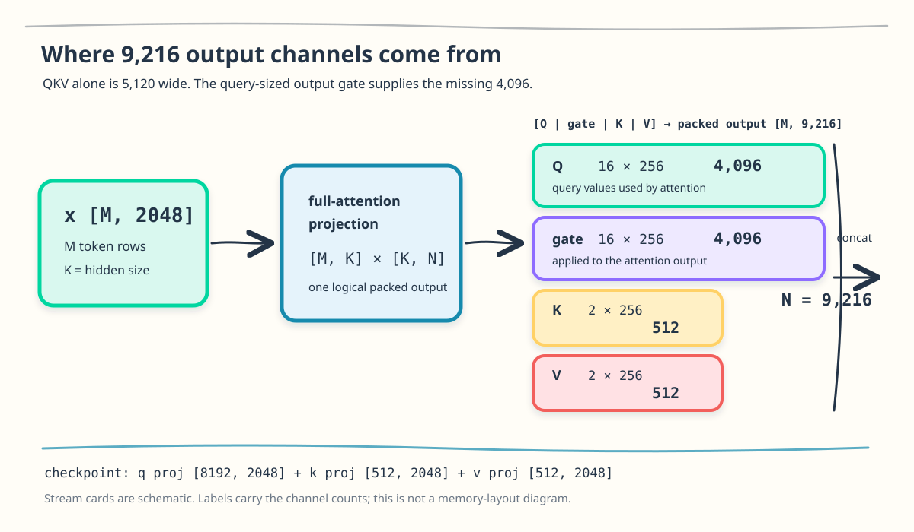
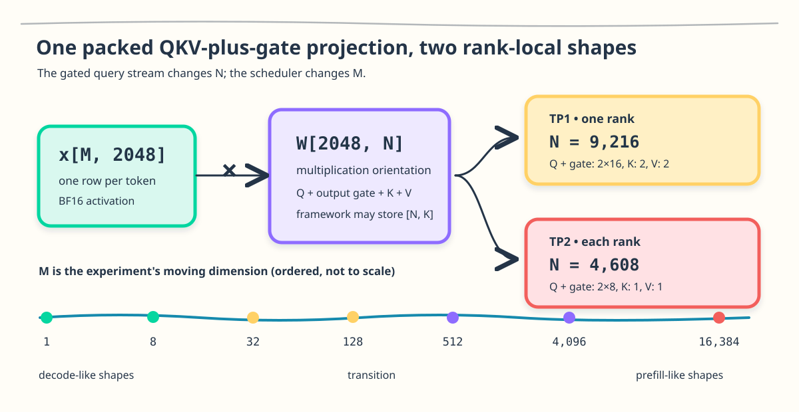

## Part I: Find the GEMM in the model

### One token enters as 2,048 numbers

I was trying to understand one full-attention projection from
Qwen3-Coder-Next on an Arc Pro B70. This was the mathematical reference I
wanted to isolate from the serving code:

```python
import torch

M, K, N = 1, 2048, 9216
x = torch.randn((M, K), device="xpu", dtype=torch.bfloat16)
# Random shape stand-in; these are not checkpoint weights.
weight = torch.randn((N, K), device="xpu", dtype=torch.bfloat16)
packed = torch.mm(x, weight.t())

print(packed.shape)
# torch.Size([1, 9216])
```

There are only three dimensions here, but starting with their names makes the
operation look more abstract than it is:

```text
1     = one token row entering this launch
2,048 = the numbers currently describing that token
9,216 = new numbers the projection produces
```

`K=2,048` comes from the model. `M=1` comes from choosing a single-token decode
launch. The last number, `N=9,216`, takes a little detective work.

The [Qwen3-Coder-Next configuration](https://huggingface.co/Qwen/Qwen3-Coder-Next/blob/main/config.json)
gives us the starting point:

```text
hidden_size             = 2048
num_attention_heads     = 16
num_key_value_heads     = 2
head_dim                = 256
num_hidden_layers       = 48
full_attention_interval = 4
```

This is a hybrid model. Three Gated DeltaNet layers are followed by one
full-attention layer, giving 36 linear-attention layers and 12 full-attention
layers. I am isolating the projection inside one of those 12 full-attention
layers. The linear-attention path has different projections and deserves its own
investigation.

The row is one decode token. Its 2,048 values are the model's hidden
representation:

```text
one decode token
       ↓
x [1, 2048]
```

In GEMM notation, this already fixes two dimensions:

$$
M = 1, \qquad K = 2{,}048.
$$

$M$ counts the token rows in this launch. $K$ is the width of every input row.
The remaining question is $N$: how many values does the projection produce?

The serving setting is the SGLang XPU backend. I am timing the rank-local GEMM,
not the complete server, attention kernel, collective, or token rate. A
standalone harness preserves the model's shapes and data types while making each
kernel change visible.

This is independent work on hardware available to me, not an Intel release or
an official Intel performance result.

### First make the projection tiny

Before attaching heads or attention to those numbers, take a toy token with
four values and project it to eight:

```text
x [1, 4] × W [4, 8]  →  y [1, 8]
```

The `1` does not change. We still have one token row. The projection reads all
four input values and produces eight new values. Each output is a dot product
between the token and one column of $W$.

Suppose those eight outputs will later be used as Q, K, and V:

```text
                 y [1, 8]
                     │
          ┌──────────┼──────────┐
          ▼          ▼          ▼
       Q [1,4]    K [1,2]    V [1,2]
```

Q is what this token asks about, K is what it compares against, and V is the
content retrieved when they match. This GEMM only constructs those tensors.

The matrix multiply does not perform attention. It creates the three regions
that attention will consume. A fused QKV projection places the three weight
matrices next to one another so one larger GEMM can produce all three regions.

The toy widths are chosen only to make the split visible. Now we can derive the
real widths from Qwen3-Coder-Next. This is a logical split for intuition; the
real Qwen/SGLang buffer uses a Q-plus-gate region with Q and gate interleaved per
head, as shown below.

### Q, K, and V explain 5,120 of the 9,216 outputs

Qwen3-Coder-Next has 16 query heads, and each head is 256 values wide:

$$
Q_{\text{width}} = 16 \times 256 = 4{,}096.
$$

K and V are narrower because the layer uses grouped-query attention. There are
two KV heads, each 256 values wide:

$$
K_{\text{width}} = V_{\text{width}} = 2 \times 256 = 512.
$$

Each KV head is shared by eight query heads because $16 / 2 = 8$. Counting only
the logical attention tensors gives the familiar QKV width:

$$
4{,}096 + 512 + 512 = 5{,}120.
$$

Now we have a discrepancy. The heads explain 5,120 outputs, while the GEMM from
the serving code produces 9,216:

$$
9{,}216 - 5{,}120 = 4{,}096.
$$

The missing width is exactly the size of Q. Looking at the
[Transformers implementation](https://github.com/huggingface/transformers/blob/main/src/transformers/models/qwen3_next/modeling_qwen3_next.py#L236-L309)
shows why: the full-attention `q_proj` produces both the query and a same-width
output gate.

The physical output is grouped by head. Each head receives 256 query values
beside 256 gate values:

```python
q_gate = q_proj(x).view(M, 16, 2, 256)  # [M, heads, Q-or-gate, head_dim]
q, gate = q_gate.unbind(dim=2)           # [M, 16, 256] each
```

Attention produces 4,096 values, those values are multiplied elementwise by
`sigmoid(gate)`, and the output projection returns them to the 2,048-wide
residual stream. The gate never becomes an attention head, but this GEMM still
has to produce it.

Adding that Q-sized gate completes the count:

```text
Q       16 × 256 = 4,096
gate    16 × 256 = 4,096
K        2 × 256 =   512
V        2 × 256 =   512
                       -----
packed width          9,216
```

<figure class="figure">

<figcaption class="figure-caption">Q, K, and V account for 5,120 values; the Q-sized output gate raises the packed projection width to 9,216.</figcaption>
</figure>

*Reading the figure: Q and its gate dominate the output width. K and V are
small because grouped-query attention shares two KV heads across 16 query
heads. The blocks show logical channel counts, not a promise about physical
memory order.*

### SGLang packs the four streams into one GEMM

The checkpoint exposes three modules: an 8,192-wide `q_proj`, a 512-wide
`k_proj`, and a 512-wide `v_proj`. SGLang's
[`QKVParallelLinear`](https://github.com/sgl-project/sglang/blob/main/python/sglang/srt/models/qwen3_next.py#L655-L670)
packs those weights into one serving module. Its
[forward path](https://github.com/sgl-project/sglang/blob/main/python/sglang/srt/models/qwen3_next.py#L765-L782)
splits the result as Q-plus-gate, K, and V, then splits Q from the gate. The
rank-local operation is one matrix multiplication. I call the activation `x`
in code and $A$ in GEMM notation:

$$
A_{M \times K} W_{K \times N} = C_{M \times N}.
$$

At tensor parallelism one:

$$
[M,2{,}048] \times [2{,}048,9{,}216] \rightarrow [M,9{,}216].
$$

The PyTorch below follows the physical split. SGLang first separates
Q-plus-gate, K, and V. Q and gate are interleaved per head inside the first
region, so that region must be reshaped before they can be separated.

```python
M, K, N = 1, 2048, 9216
x = torch.randn((M, K), device="xpu", dtype=torch.bfloat16)
# Shape/layout stand-in for the model weights loaded by SGLang.
weight_qgkv = torch.randn((N, K), device="xpu", dtype=torch.bfloat16)

packed = torch.mm(x, weight_qgkv.t())
q_gate, k, v = packed.split((8192, 512, 512), dim=-1)
q_gate = q_gate.view(M, 16, 2, 256)
q, gate = q_gate.unbind(dim=2)  # each is [M, 16, 256]
```

The timed region ends at `packed`. The split and reshape are shown to make the
layout concrete; they are outside the GEMM measurement.

PyTorch stores a linear weight as `[out_features, in_features]`, so
`weight_qgkv` is `[N,K]`. Calling `.t()` presents the multiplication as
`[M,K] × [K,N]`; it does not imply that the backend copies or physically
transposes the weight for every call.

The benchmark requests BF16 activations and weights, BF16 output, and treats
FP32 accumulation as the intended contract. The harness checks each candidate
against an untimed FP32 reference. That validates the result, not the
instructions used to produce it. Later, oneDNN verbose output and compiler
artifacts will tell us which primitive and instructions actually executed.

### Tensor parallelism changes the GEMM each rank sees

At TP2, each rank owns eight query heads and one KV head. The gate follows the
query partition:

```text
Q       8 × 256 = 2,048
gate    8 × 256 = 2,048
K       1 × 256 =   256
V       1 × 256 =   256
                      -----
rank-local N         4,608
```

So the two shapes carried through the article are:

```text
TP1: A[M, 2048] × W[2048, 9216]
TP2: A[M, 2048] × W[2048, 4608]  per rank
```

TP2 halves the GEMM work assigned to each rank. Across both ranks, the global
projection still produces 9,216 values per token. The single-card TP2 rows below
measure one rank's GEMM; they do not include collectives or end-to-end
tensor-parallel latency.

### The scheduler turns one GEMM into seven shapes

For a chosen TP setting, the model fixes $K$ and that rank's packed output
width. The serving scheduler supplies $M$. A single decode stream contributes
one new token row. Continuous batching can put several decode rows into the
same launch. Prefill contributes hundreds or thousands of rows at once,
depending on the chunking policy.

I sweep $M$ through seven values from 1 to 16,384. The labels below describe the
serving regime each point is meant to represent; they are not claims about an
exact scheduler threshold. The head counts give us $N$. The scheduler gives us
$M$.

<figure class="figure">

<figcaption class="figure-caption">The gated query stream changes the rank-local width: TP1 uses N=9,216 and TP2 uses N=4,608. The ordered, not-to-scale M rail shows why the same GEMM needs different amounts of row parallelism.</figcaption>
</figure>

*Reading the figure: the head streams determine the width of each rank's
output tile, while the ordered M rail changes how many rows the launch must
cover.*

| `M` | Representative serving shape | Local `N` TP1 / TP2 | Per-rank work TP1 / TP2 |
|---:|---|---:|---:|
| 1 | single-token decode | 9,216 / 4,608 | 37.75 / 18.87 MFLOP |
| 8 | small batched decode | 9,216 / 4,608 | 301.99 / 150.99 MFLOP |
| 32 | larger batched decode | 9,216 / 4,608 | 1.21 / 0.60 GFLOP |
| 128 | decode/prefill transition | 9,216 / 4,608 | 4.83 / 2.42 GFLOP |
| 512 | chunked prefill | 9,216 / 4,608 | 19.33 / 9.66 GFLOP |
| 4,096 | long prefill chunk | 9,216 / 4,608 | 154.62 / 77.31 GFLOP |
| 16,384 | long packed prefill | 9,216 / 4,608 | 618.48 / 309.24 GFLOP |

The main story follows Qwen3-Coder-Next. Ornith has the same local geometry, so
I will use it later as a shape-level comparison rather than a second model
implementation. I will also measure the ungated $N=5{,}120$ QKV shape as a
control. That comparison asks a narrower question: what changes when the same
hidden input produces Q, K, and V without the extra 4,096-wide gate?

The work column is $2MNK$, counting a multiply and an add as two floating-point
operations. It is calculated work, not measured speed. At TP1 and $M=1$, the
GEMM contains 37.75 MFLOP. At $M=16{,}384$, the same weights produce 618.48
GFLOP of work. We expect the larger shape to amortize fixed launch and submission
overhead; the baseline and kernel ladder will test that expectation.

Changing $M$ is the experiment. At small $M$, I need to make launch overhead and
weight movement cheap enough for a thin grid. At large $M$, I need tiles that
keep the matrix engines fed without spending too many registers on reuse. A
kernel that looks excellent at one end of this table can be the wrong kernel at
the other end.

Within each TP series, I will keep $K$, $N$, dtype, and rank-local layout fixed
while changing one mechanism at a time. The sequence is straightforward: start
with the readable reference, give each program more than one output, check
whether the compiler emits DPAS, change how tiles load data, and only then tune
tile shape and scheduling. After each change I rerun all seven shapes before
touching the next knob.

These seven shapes define the demand we will place on the card. Before changing
a kernel, we need the few B70 limits that predict where each shape will
struggle.

### The one B70 we have to satisfy

### What would fast mean here?

### How the evidence was collected

## Part II: From readable math to the matrix engine

### The readable kernel leaves almost everything idle

### A tile creates reuse and a register bill

### Did Triton actually reach XMX?

## Part III: Feeding and scheduling the matrix engine

### The load expression changes the generated machine

### Bigger tiles spend registers to buy reuse

### Grouping and persistence only help a healthy tile

## Part IV: One GEMM family, several winners

### Decode and prefill choose different winners

### What SYCL-TLA does that our Triton kernel still does not

### The dispatch table we would actually ship
