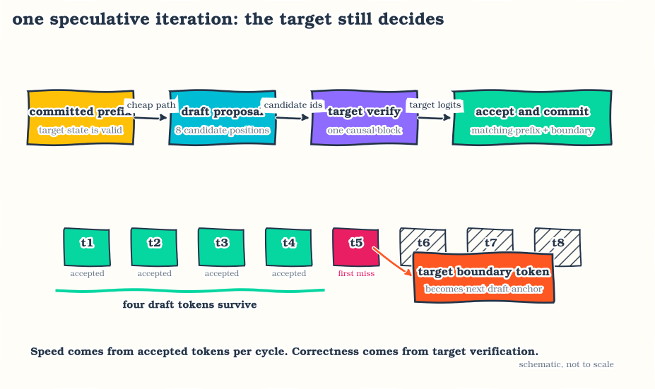
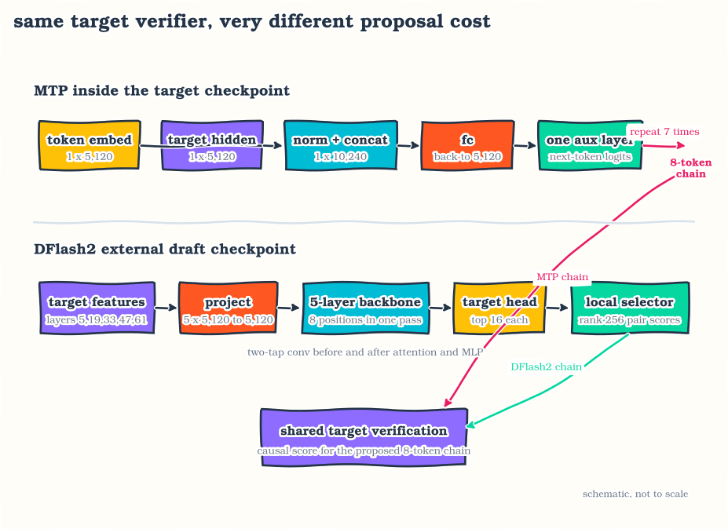
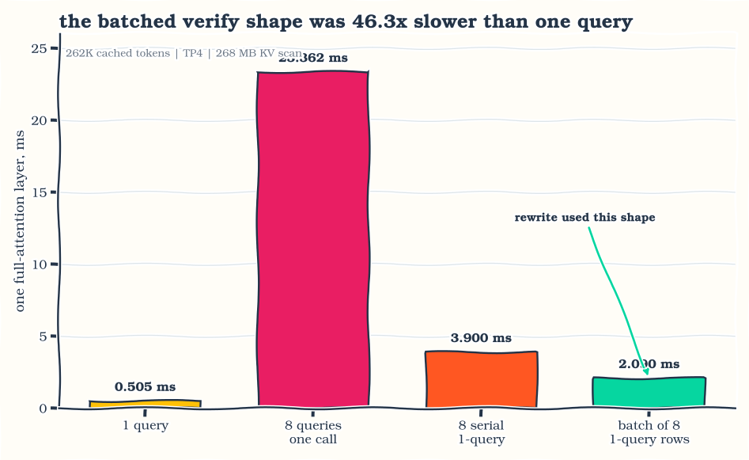
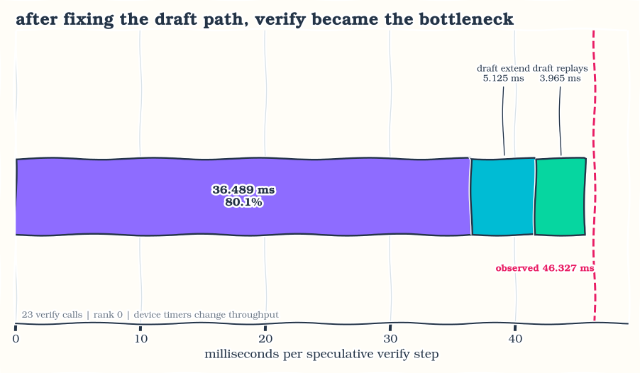
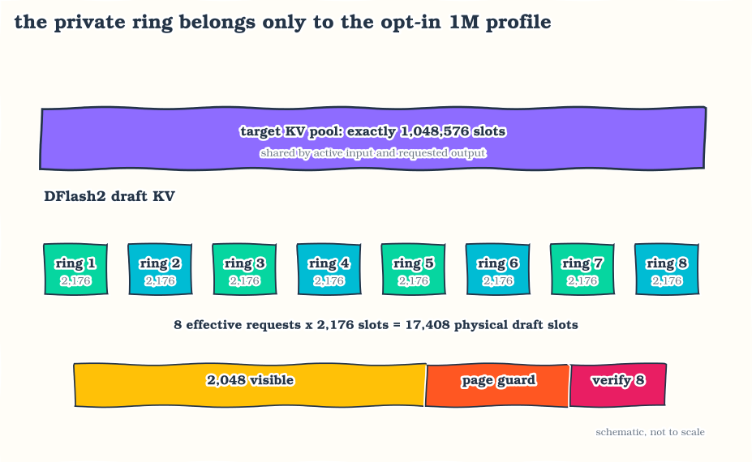
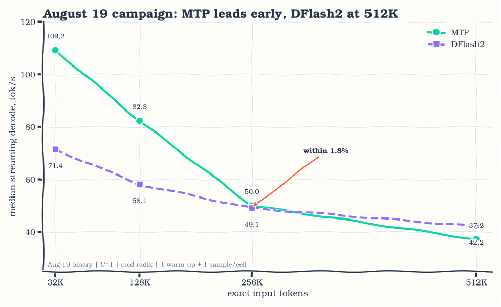
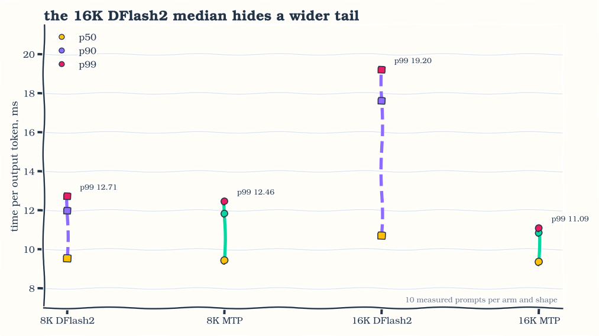

I was already deep into making Qwen3.8's MTP head useful on Arc Pro when
[DFlash2 landed](https://inco.ai/blog/dflash2/). It had been public for barely
two days. I wanted to know if I could get this brand-new draft model running on
four B70s without giving up the 1,048,576-token target pool I had built the
server around.

I got it working, including the ugly parts: XPU support, tensor parallel
candidate selection, a compact draft KV cache, radix reuse, graph lifecycle,
and long-context verification. Then I ran it against MTP all the way to a 512K
prompt. That is the part of this result I am most excited about. This was not an
old speculative path that happened to start on XPU. DFlash2 had just been
released, and I had the real checkpoint serving long-context requests on Arc
Pro.

I wanted the comparison to match how I use this model: long coding
sessions where the repository, tool history, and working notes keep filling the
prompt. A speedup at 8K is not much use to me if it disappears later in the same
session.

What I ended up with is a crossover rather than one mode winning everywhere.
On four Intel Arc Pro B70s at tensor parallel four, MTP reaches **109.2 tok/s at 32K** and
**82.3 tok/s at 128K**. DFlash2 catches it at 256K, then leads **42.2 to 37.2
tok/s at 512K**. Both runs use the same AWQ W4A16 target, exact prompt lengths,
one warm-up per shape, a cold radix cache, and median streaming decode. Their
greedy completions are byte-identical at every matched shape.

It took much more than two server flags. I found an MTP head built from
uninitialized packed tensors. I found an eight-query verify kernel that was 46
times slower than the one-query shape over the same KV. I added a native XPU
multi-step backend for the MTP draft. For DFlash2, I pinned the source, built a
physical sliding-window KV ring, kept graph capture on the target only, and
stopped unsupported requests before they reached the worker. Some fixes did
nothing. A few made the server slower.

This is independent work I did on my own setup. The DFlash2 checkpoint and
mechanism come from Inco. The SGLang XPU integration, memory accounting,
lifecycle fixes, and Arc Pro measurements are mine.

## Part I: The setup and the number I use

### Running it

This is the image I used:

```bash
docker pull rahulunair/sglang-xpu:qwen3.8-27b-20260819
```

The published repository digest is
`sha256:12a3ad504d0524dc090bdc7370dd8d369d6b0a3c3c520ea9b8107d21923653ec`.
After pulling, this command prints the immutable repository reference resolved
on the machine:

```bash
docker image inspect rahulunair/sglang-xpu:qwen3.8-27b-20260819 \
  --format '{{index .RepoDigests 0}}'
```

The AWQ target is
[`ulkaa/Qwen3.8-27B-AWQ-INT4`](https://huggingface.co/ulkaa/Qwen3.8-27B-AWQ-INT4),
using its `1m` revision. DFlash2 adds
[`incoai/Qwen3.8-27B-DFlash2`](https://huggingface.co/incoai/Qwen3.8-27B-DFlash2)
as the draft checkpoint. The complete copy-paste Docker invocation is in the
[Qwen3.8-27B Docker Hub recipe](https://hub.docker.com/r/rahulunair/sglang-xpu#qwen38-27b).
It calls `python -m sglang.launch_server` directly and does not depend on a
wrapper script.

Download both model trees on the host. Pinning the target to its `1m` revision
is part of reproducing the capacity result:

```bash
hf download ulkaa/Qwen3.8-27B-AWQ-INT4 --revision 1m \
  --local-dir "$PWD/models/Qwen3.8-27B-AWQ-INT4-1m"
hf download incoai/Qwen3.8-27B-DFlash2 \
  --local-dir "$PWD/models/Qwen3.8-27B-DFlash2"
```

The target pool settings are:

```text
--context-length 1048576
--max-total-tokens 1048576
--max-mamba-cache-size 40
--max-running-requests 64
```

MTP uses the auxiliary head already stored in the target checkpoint:

```bash
--speculative-algorithm EAGLE \
--speculative-num-steps 7 \
--speculative-eagle-topk 1 \
--speculative-num-draft-tokens 8
```

DFlash2 uses one external five-layer draft checkpoint:

```bash
--speculative-algorithm DFLASH \
--speculative-draft-model-path /draft \
--speculative-num-draft-tokens 8 \
--speculative-dflash-block-size 8 \
--speculative-draft-window-size 2048
```

Here is the complete DFlash2 command I used. The render group expression lets
the container open the Intel device nodes without assuming one host-specific
group id:

```bash
docker run -d --name qwen38-dflash2 --restart unless-stopped \
  --device=/dev/dri -v /dev/dri:/dev/dri \
  --group-add video --group-add "$(getent group render | cut -d: -f3)" \
  --ipc=host --shm-size=64g \
  --cap-add=SYS_PTRACE --security-opt seccomp=unconfined \
  --ulimit memlock=-1 --ulimit stack=67108864 \
  -p 30000:30000 \
  -e ONEAPI_DEVICE_SELECTOR=level_zero:gpu \
  -v "$PWD/models/Qwen3.8-27B-AWQ-INT4-1m:/model:ro" \
  -v "$PWD/models/Qwen3.8-27B-DFlash2:/draft:ro" \
  rahulunair/sglang-xpu:qwen3.8-27b-20260819 \
  python -m sglang.launch_server \
    --model-path /model --served-model-name Qwen3.8-27B \
    --device xpu --tp-size 4 --trust-remote-code --language-only \
    --context-length 1048576 --max-total-tokens 1048576 \
    --max-mamba-cache-size 40 --max-running-requests 64 \
    --chunked-prefill-size 4096 --mem-fraction-static 0.85 --page-size 64 \
    --attention-backend intel_xpu --disable-custom-all-reduce \
    --reasoning-parser qwen3-thinking --tool-call-parser qwen3_coder \
    --strip-thinking-cache --enable-strict-thinking \
    --watchdog-timeout 1800 --skip-server-warmup --enable-cache-report \
    --cuda-graph-config '{"decode":{"backend":"full","bs":[1,2,4,8]},"prefill":{"backend":"disabled"}}' \
    --speculative-algorithm DFLASH \
    --speculative-draft-model-path /draft \
    --speculative-num-draft-tokens 8 \
    --speculative-dflash-block-size 8 \
    --speculative-draft-window-size 2048 \
    --host 0.0.0.0 --port 30000
```

For MTP, remove the `/draft` mount and replace the five DFlash2 flags at the end
with the four MTP flags shown above. No external MTP checkpoint is needed.

The image supplies the XPU defaults I measured: decode INT8 up to M=8,
symmetric all-reduce up to 131,072 bytes,
single-query speculative verify, target decode graphs for batch sizes
`[1,2,4,8]`, and eager DFlash2 draft execution. Radix prefix caching stays on.

Use `/health` for process readiness. The first ordinary request at a new shape
may compile kernels and needs a long client timeout. A cold `/health_generate`
probe became part of the last release failure described later, so I left it out
of the public recipe.

### What I mean by decode speed

Every decode number in this post is:

```text
median streaming decode = 1000 / median TPOT in milliseconds
```

TPOT starts after the first token. It answers how quickly a user sees the rest
of a streamed completion. The benchmark's raw output throughput divides output
tokens by the whole request interval, so it includes time to first token. At
long prompt lengths the two figures can differ by an order of magnitude even
for concurrency one.

For concurrent runs, `1000 / median TPOT` remains a per-user streaming figure.
Multiplying it by concurrency gives a derived number, not an observed server
throughput. The table therefore keeps actual aggregate output throughput in a
separate column.

For the final long-context sweep I used:

- four Arc Pro B70 cards, TP4;
- AWQ W4A16 target, YaRN factor four, exact 1,048,576-token target pool;
- Intel XPU attention, page size 64, chunked prefill 4,096;
- target decode graph buckets `[1,2,4,8]`, prefill graphs disabled;
- radix enabled in the product but flushed for each cold benchmark cell;
- concurrency one, one unreported warm-up, one reported exact-length prompt;
- greedy generation, with output text retained for coherence comparison.

One sample per long-context point gives me a rough serving curve, not a latency
distribution. I used ten reported prompts per point for the shorter 8K and 16K
comparison, which I show separately.

## Part II: What I had enabled

### The loop both modes use

Before changing the XPU code, I needed a clean picture of what each worker was
doing. MTP and DFlash2 both end at target verification, but they arrive there
in very different ways.

Ordinary autoregressive decoding runs the target once for each next token.
Speculative decoding adds a cheaper proposal path:

1. The draft proposes a short continuation.
2. The target scores the proposed causal block in one verification pass.
3. The runtime accepts the longest valid prefix and commits the target-selected
   boundary token.
4. Draft and target state advance to the next step.

The target remains responsible for verification. A broken draft can waste work
while generation still looks coherent because every proposal is rejected. That
behavior hid the first MTP defect.

MTP and DFlash2 share the target verification path but produce proposals
differently. Qwen's MTP mode runs an in-checkpoint auxiliary layer repeatedly.
With seven draft steps it proposes up to eight tokens. DFlash2 runs a separate
five-layer sliding-attention backbone once for the block, obtains the target
LM-head top-16 candidates, and walks a learned predecessor-successor lattice to
choose a path.

| mode | SGLang algorithm | proposal mechanism | draft width I used |
|---|---|---|---:|
| MTP | `EAGLE` | seven sequential forwards through the in-checkpoint MTP head | 8 |
| DFlash2 | `DFLASH` | one five-layer block draft plus learned candidate selector | 8 |

Classic DFlash uses the same `DFLASH` algorithm name but a different model
class and selector. The release checks `DFlash2DraftModel` explicitly so a
classic DFlash tree cannot be published under the DFlash2 label.

{fig-alt="A four-stage speculative iteration: a cheap draft proposes eight positions, the target verifies all eight causally, the runtime accepts the valid prefix plus a target boundary token, and both state machines commit only verified tokens."}

*Speculation changes how many target calls are needed; it does not let the draft commit an unverified token.*

The accepted-length metric used by SGLang includes the verified boundary token.
An average accepted length of 4 therefore means that one target verification
committed about four output tokens, not four correct draft guesses plus another
unreported token. That convention matters when dividing cost by useful work.

### Why the target output stayed the same

Consider a draft block `[d1, d2, d3, d4]`. The target evaluates all four rows
with a causal mask. Row one sees the committed prefix, row two also sees `d1`,
and so on. Suppose the target's greedy choices are `[d1, d2, x, ...]`. The
runtime commits `d1`, `d2`, and the target token `x`; `d3` and `d4` never enter
the target KV cache. The next iteration begins after `x`.

This is why the method can change speed without changing greedy output. Draft
tokens are proposals, and the target selects every committed token. I ran these
tests at temperature zero, so equality means exact token equality at each
position. Sampling requires rejection sampling against target and draft
probabilities. SGLang has that machinery too, but I did not measure it here.

### What Qwen's MTP head does

The Qwen3.8 checkpoint contains one multi-token prediction module. SGLang loads
it through `Qwen3_5ForCausalLMMTP`, while `EAGLEWorkerV2` owns the speculative
loop. The names can be confusing: `EAGLE` is the serving algorithm selected at
launch, and Qwen's MTP module is the draft network that this worker repeatedly
calls.

For one draft position, the module receives two vectors:

- the embedding of the token entering the draft step, shape `[1, 5120]`;
- the target hidden state at the same boundary, shape `[1, 5120]`.

It applies RMS normalization to each vector independently, concatenates them
into `[1, 10240]`, and projects the result back to `[1, 5120]` with `mtp.fc`.
That fused representation passes through one auxiliary Qwen decoder layer and
the target vocabulary head. Top-k one selects the next proposed token.

The worker repeats this dependency seven times. Each call consumes the hidden
state produced by the previous draft call, so the seven proposals are
sequential. The target then verifies eight positions: the already available
boundary position plus seven new proposals. That is why the command uses seven
steps and eight draft tokens.

The auxiliary module remains BF16 even though the target transformer is AWQ
W4A16. Its parameter names must therefore be excluded from compressed-tensors
quantization. Missing that exclusion caused the silent all-zero draft failure
described in Part III.

### What arrived with DFlash2

The external DFlash2 checkpoint declares `DFlash2DraftModel`. This is the
configuration I used:

| component | Qwen3.8-27B DFlash2 value |
|---|---:|
| target feature layers | 5, 19, 33, 47, 61 |
| target hidden width | 5,120 |
| concatenated feature width | 25,600 |
| draft backbone | five sliding-attention layers |
| sliding window | 2,048 tokens |
| block size | 8 positions |
| selector candidates | top 16 per position |
| selector rank | 256 |
| local convolution | grouped, kernel size 2 |

During target prefill, SGLang captures the hidden rows from those five target
layers. DFlash2 concatenates the rows, projects `[5 × 5120]` back to width
5,120, and materializes them into the draft model's private KV storage. The
draft checkpoint has neither its own token embedding nor its own LM head. It
reuses the target embedding on input and the target vocabulary head when it
needs candidate logits.

One decode call lays out eight draft positions. Position zero holds the current
verified boundary token. The remaining positions start as mask tokens. The
five-layer backbone processes this block with 2,048-token sliding attention.
Each layer also applies a learned two-tap grouped convolution around its
attention and MLP path. A position mixes its current representation with the
immediately preceding position; at the block boundary that preceding value is
the final verified state. This local dependency gives later masked positions a
cheap signal about the emerging suffix without making eight full sequential
draft-model calls.

The target LM head produces candidate logits for each position. On TP4, each
rank first selects its local top 16 vocabulary entries. SGLang gathers the 64
rank-local candidates and performs a global top 16 selection, preserving the
same candidate set a non-sharded vocabulary head would expose.

### The part that makes DFlash2 different

DFlash2 does not independently choose the highest-logit token in every row.
Its selector scores transitions between adjacent candidate sets. The research
line is described in the [DFlash paper](https://arxiv.org/abs/2602.06036), and
the DFlash2 selector and convolution changes are explained in
[Inco's DFlash2 article](https://inco.ai/blog/dflash2/). Using Inco's notation, a
transition from candidate `a` to candidate `b` at position `t` has the form:

```text
S_t(a, b) = U_t(b) + dot(A(a) * H(h_t), B(b))
```

`U_t(b)` is the ordinary unary score for candidate `b`. `A(a)` and `B(b)` are
learned predecessor and successor codebook rows. `H(h_t)` projects the draft
hidden state, and the elementwise product scales the predecessor representation.
The interaction lives in rank 256 rather than the 5,120-wide model space.

For top 16, every adjacent pair contributes a 16 by 16 score matrix. Those
matrices are computed in parallel. A short sequential walk then chooses the
best successor at each position, conditioned on the candidate already chosen.
The selector improves path consistency, but it never authorizes a token. The
target still verifies the resulting chain and rejects the invalid suffix.

The XPU port uses `torch.topk` when FlashInfer's radix top-k operator is absent.
That fallback is correct and is the path in this image. A shape-matched XPU
top-k kernel is something I still want to test, so I check the model type and
candidate shape separately from the kernel used for top-k.

{fig-alt="Side-by-side mechanism comparison. MTP normalizes and fuses one token embedding with one target hidden row, then runs one auxiliary layer seven times. DFlash2 projects five target feature rows, runs a five-layer sliding-window block once, scores a top-16 transition lattice, and sends one eight-position chain to the same target verifier."}

*MTP spends seven small sequential forwards to build its chain; DFlash2 spends one block forward plus a learned path selection. Both still run the same target verification step.*

### Where this lives in SGLang

Both workers begin with a normal target prefill. After that, the control flow is
similar: prepare draft inputs, produce candidates, call target verify, accept a
prefix, commit recurrent state, and prepare the next draft boundary. The shared
worker interface lets both modes use the same target scheduler, KV pool,
request batching, and output path.

The state details differ. MTP's worker carries one auxiliary hidden row through
seven draft forwards. DFlash2's worker carries a compact sliding-window KV ring
and five target feature streams. After target verification, it writes the
committed target hidden rows back into the correct physical ring slots so the
next block begins from verified state. Rejected draft rows are never allowed to
become committed history.

I kept losing track of which worker owned which piece of state. The release tree
is pinned at commit `7a65e2e`, and these are the five files I kept open while
working through it:

| concern | release source |
|---|---|
| Qwen MTP tensor path | `overlay/sglang/srt/models/qwen3_5_mtp.py` |
| MTP worker loop | `overlay/sglang/srt/speculative/eagle_worker_v2.py` |
| DFlash2 model and selector | `overlay/sglang/srt/models/dflash.py` |
| DFlash2 worker loop | `overlay/sglang/srt/speculative/dflash_worker_v2.py` |
| XPU ring and lifecycle behavior | `20-patches/spec/post/0008-xpu-dflash2-production.patch` |

## Part III: MTP looked fixed until the context grew

### Repairing the MTP checkpoint before tuning it

My first MTP server generated readable text and reported an average accepted
length near **1.008** across code, arithmetic, and prose. That workload-invariant
value was the clue. A merely weak drafter should have varied with the prompt.

When I logged the candidates, I found token id zero in every draft slot. The
draft seed was NaN, and the NaN began inside the MTP layer. Its projection
modules had shape metadata but no loaded weight tensor.

The checkpoint stores the MTP head in BF16. Its `quantization_config.ignore`
list excluded vision modules but omitted `mtp.*`, so SGLang constructed the
head as compressed-tensors W4A16. The corresponding packed tensors do not exist
because the weights are plain BF16. No load exception surfaced; the
uninitialized path produced NaNs and `argmax` selected zero.

I fixed the configuration rather than changing any weight bytes. The ignore list now
contains the eight checkpoint-facing MTP module names plus the fused
`qkv_proj` and `gate_up_proj` module names SGLang constructs. Acceptance moved
from approximately 1.0 to a useful range. Both Hugging Face publication paths
now reject a card or config whose MTP exclusions are missing.

This is where I learned that coherent target output says very little about the
draft. I now check acceptance and the modules that loaded beside the
generated text.

### Finding the useful MTP window at short context

The original 8,192-input, 1,024-output sweep on the native 262K pool was:

| draft width | median decode | accepted length | accepted / width |
|---:|---:|---:|---:|
| off | 59.1 tok/s | | |
| 2 | 44.9 tok/s | 1.943 | 97 percent |
| 4 | 68.6 tok/s | 3.507 | 88 percent |
| **8** | **102.6 tok/s** | **7.262** | **91 percent** |
| 10 | 85.3 tok/s | 6.827 | 68 percent |
| 12 | 91.9 tok/s | 8.063 | 67 percent |
| 16 | 86.5 tok/s | 8.904 | 56 percent |

Eight was the last width inside the oneDNN M=8 tier, where verify can reuse a
weight read. Wider drafts accepted more tokens in absolute terms but accepted a
smaller fraction and crossed into a more expensive matrix tier.

Two configured XPU paths were also declining this exact verify shape:

```text
XPU dense int8: declined because M=8 exceeded a cap of 4
SYMM AR: declined because 81,920 bytes exceeded a cap of 65,536
```

I raised the decode caps to M=8 and 131,072 bytes. The same point moved from
102.6 to 105.5 tok/s, but the long-context curve remained broken. Once again, a
server accepting a flag at startup did not mean that the request used the
kernel I expected.

### Reducing an eight-query verify that was 46 times slower

Before the long-context fixes, MTP looked good at 8K and collapsed at 16K:

| prompt context | no speculation | MTP width 8 |
|---:|---:|---:|
| 8,192 | 59.1 tok/s | **102.6 tok/s** |
| 16,384 | **58.1 tok/s** | 42.6 tok/s |
| 32,768 | **56.3 tok/s** | 37.5 tok/s |
| 131,072 | **48.9 tok/s** | 8.3 tok/s |
| 262,144 | **41.6 tok/s** | 4.3 tok/s |

I first blamed the Python stack. All 25 `py-spy` samples sat in
`resolve_seq_lens_cpu`. Turning overlap off produced a 1,073.02 ms step against
1,072.90 ms with overlap on. Python was waiting for device work there; the host
function did not own the cost.

I then removed the model and held the KV bytes constant. At the
TP4 attention shape and 262,144 cached tokens, one and eight queries both read
268 MB:

| query rows | time per full-attention layer | effective bandwidth |
|---:|---:|---:|
| 1 | 0.505 ms | about 531 GB/s |
| 8 | 23.362 ms | about 11.5 GB/s |

Eight query rows took **46.3 times** as long. Explicit split counts of 0, 8,
and 32 measured 23.362, 23.358, and 23.335 ms, so the obvious split flag was not
connected to this path.

For a top-k-one chain, proposal position *j* attends to the committed prefix
and only the earlier proposals. The same causal relation can be represented as
independent one-query rows with a separate cache length for each position:

| equivalent formulation | time per layer | relative to one eight-query call |
|---|---:|---:|
| one call with eight queries | 23.445 ms | 1.0x |
| eight serial one-query calls | 3.900 ms | 6.0x faster |
| batch of eight one-query rows | **2.090 ms** | **11.2x faster** |

{fig-alt="At 262K cached tokens, one eight-query attention call takes 23.362 milliseconds. Eight serial single-query calls take 3.900 milliseconds, and one batch of eight independent single-query rows takes 2.090 milliseconds."}

*Representing a linear top-k-one verify as eight independent single-query rows cuts the measured attention layer from 23.362 to 2.090 milliseconds without changing causal dependencies.*

Patch 0006 applies the batched single-query formulation to target verify. The
accepted length and output stayed unchanged. At 8K, the development point moved
from 105.5 to **126.2 tok/s**; at 262K it moved from about 4.2 to 6.8 tok/s.
The second number showed that I had fixed only part of the problem. Verify
attention was expensive, but the draft path was still getting slower with
context.

### Adding the XPU multi-step draft backend

After the verify rewrite, fitting the 262K speculative step attributed about
298.5 ms to target verify and roughly 410 ms to seven draft forwards. The MTP
draft model was still using a generic Triton attention backend.

In patch 0007 I added native XPU metadata and attention for draft decode and draft
extend. Each linear draft position receives the committed prefix plus the
earlier proposed positions. Tree drafting is rejected because the metadata
layout only describes a linear top-k-one chain.

Graph capture exposed another context assumption. Decode graph buckets
`[1,2,4,8]` describe batch sizes, but every bucket still needs page-table and
sequence metadata wide enough for the full 1M context. The first implementation
retained a lazily allocated 262K-shaped buffer and failed on a later bucket.
The repaired backend allocates one max-context buffer set with stable views for
each captured batch size.

These were my first useful long-context rows after patch 0007, before I ran the
final matched sweep:

| exact input / output | draft width | sample | median decode | acceptance |
|---:|---:|---|---:|---:|
| 131,072 / 512 | 4 | seed 1 | 111.786 tok/s | 3.879 |
| 131,072 / 512 | 4 | seed 2 | 94.157 tok/s | 3.241 |
| 262,144 / 256 | 4 | seed 1 | 80.000 tok/s | |
| 262,144 / 256 | 4 | seed 2 | 74.488 tok/s | |
| 262,144 / 256 | 3 | hard seed | 86.683 tok/s | 2.723 |
| 524,288 / 64 | 3 | hard seed | 68.580 tok/s | 2.723 |

These rows use different outputs, prompts, and draft widths. They are useful
diagnostics and cannot substitute for the matched table later in the post.

### Timing the 524K step after the draft fix

I still suspected the MTP auxiliary head, so I added device phase timers. I was
wrong.

One 524,288-input, 64-output request with width three produced 23 verification
steps. The timers add enough overhead that their throughput never enters a
performance table. Their phase split does:

| device phase, rank 0 | total over 23 verifies | per verify | categorized share |
|---|---:|---:|---:|
| target verify | 839.242 ms | **36.489 ms** | **80.1 percent** |
| draft extend | 117.873 ms | 5.125 ms | 11.2 percent |
| both draft replays | 91.195 ms | 3.965 ms | 8.7 percent |
| categorized sum | | **45.579 ms** | 100 percent |
| observed timer-step median | | 46.327 ms | |

{fig-alt="Device phase attribution for one MTP verification step at 524K. Target verification takes 36.489 milliseconds and 80.1 percent of categorized time, draft extend takes 5.125 milliseconds, and two draft replays take 3.965 milliseconds."}

*After the native XPU draft backend landed, target verification owned 80.1 percent of categorized MTP step time at 524K.*

The measured parts close within 0.75 ms. The timer-free request ran at 68.580 tok/s
with a 39.934 ms median step. The timer-enabled request fell to 58.206 tok/s, a
reminder that the timer itself changes the result.

I had also suspected the Gated Delta recurrent commit. Small probes put the
Mamba commit near 0.215 ms and hidden-state materialization near 2.2 ms. Target
verification was taking most of the measured time. Gated Delta state capacity
still affects how many requests fit, but it did not explain this decode
slowdown.

I tried two more target-attention ideas. Folding two query
positions into the head dimension was bit-exact with a contiguous page table,
but it took 3.373 ms versus 1.377 ms for three single-query rows at 524K. Near
1M it took 6.580 versus 2.212 ms. Forcing 20 KV splits also lost to automatic
selection, 1.026 versus 0.990 ms at 524K and 2.088 versus 1.954 ms near 1M.

## Part IV: DFlash2 needed more than an XPU flag

### Pinning the DFlash2 source I used

DFlash2 arrived from an unmerged SGLang development line. At one point my
generated overlay contained the newer DFlash worker and the release image's
older `dflash.py`, which exported classic DFlash only. The worker looked right.
The model registry showed that I had mixed two source trees.

The release process now pins DFlash2 source commit
`e5a3e4d30fa7abda95bafd2d697f9f9c48566114`. A deterministic port writes an
overlay manifest, and the build imports the result before checking that
`DFlash2DraftModel` is registered. The launch reads the draft checkpoint's
declared architecture, block size, and sliding window. A classic DFlash model
cannot start under a DFlash2 name.

The active patch order is 0001, 0003, 0005, 0006, 0007, the pinned DFlash2
port, then patch 0008. The first five additions enable the XPU
algorithm, select the available draft backend, repair state indexing, rewrite
linear-chain verify, and supply native multi-step MTP attention. Patch 0008
contains the physical DFlash2 ring, radix-tail repopulation, graph settings, cache
flush hooks, and request validation.

### Turning a logical window into a physical KV ring

DFlash2 declares a 2,048-token sliding window. The first compact implementation
only shortened the request table. Its physical draft allocator still reserved
one draft KV row for every target token.

That distinction mattered immediately:

| DFlash2 draft allocation | reported target pool |
|---|---:|
| BF16 full-context draft KV | 789,312 tokens |
| draft-only FP8 diagnostic at memory fraction 0.95 | 948,544 tokens |
| target pool I wanted to preserve | **1,048,576 tokens** |

The FP8 diagnostic also hit a oneCCL out-of-resources error on its first 4,096
token prefill despite 2.91 GiB reported free after graphs. Raising the memory
fraction could improve the startup banner while removing the workspace needed
by a real request.

I replaced it with a private, page-aligned ring for each live
request. With a 2,048-token window, page size 64, and eight-token verify block,
the aligned stride is 2,176 slots. Eight effective requests therefore need:

```text
8 requests × 2,176 draft slots = 17,408 physical draft-KV slots
```

{fig-alt="DFlash2 keeps the one-million-token target KV pool intact while eight live requests receive private 2,176-slot draft rings. Absolute draft positions wrap within each ring, and a radix prefix hit repopulates the visible 2,048-token tail from verified target hidden states."}

*Eight private 2,176-slot rings reduce DFlash2 draft storage to 17,408 physical slots while the target retains its complete 1,048,576-token pool.*

Absolute token positions map into that private ring. The compact request table
contains draft-local physical indices, while target verification continues to
use the full target pool. On a radix prefix hit, the target holds back the
visible draft tail, recomputes its hidden states, and repopulates the new
request's ring. This is why a logical sliding-window flag alone could not solve
the capacity problem.

Capturing both target and draft graphs still reduced the target pool to
1,029,184 tokens and had shown unstable long-tail steps. Keeping the target
decode graph and running the much smaller DFlash2 draft eagerly preserved the
exact **1,048,576-token target pool**. I therefore kept target graphs and ran
the small DFlash2 draft eagerly.

### Surviving cache and graph lifecycle failures

The explicit `POST /flush_cache` path once produced a successful first
generation, a successful flush response, then `UR_RESULT_ERROR_DEVICE_LOST` on
the next generation. Client disconnects and a 12-turn shifting-prefix session
passed; the defect belonged to the administrative allocator and graph
lifecycle rather than the normal OpenAI-compatible agent path.

I tried all of the following with draft graphs still enabled:

- clearing or zeroing the compact request table;
- synchronizing before the scheduler cleared pools;
- skipping `torch.xpu.empty_cache()`;
- synchronizing the target graph;
- forcing the selector eager;
- creating a private draft graph pool.

Graph-off passed but gave up too much throughput. A graph teardown and
post-flush recapture hook passed small lifecycle probes, then the recaptured 8K
path regressed to 62.407 and 46.230 tok/s with severe p90 and p99 step tails.
The process survived, but the serving result was worse.

The image disables DFlash2 draft graphs and retains target graphs. The draft is
small enough that eager execution works well here. The cache hooks remain in
case someone overrides that setting. DFlash2 also
rejects logprob-returning requests before scheduling because its chain-stride
logprob path is not implemented; the older behavior allowed such a request to
reach a crash-prone path.

## Part V: Then I measured the whole server

### Prefill was still prefill

Speculative decoding changes output-token generation. It does not make a
524K-token prompt cheap to ingest.

The matched final sweep shows prefill falling from roughly 3.3K tok/s at 32K
to about 1.4K tok/s at 512K. An earlier instrumented 524K request made the
shape visible across its 128 chunks of 4,096 tokens: early chunks ran around
2,400 tok/s, final chunks around 817 tok/s, and the whole prompt took 427.6
seconds to first token. Each new full-attention chunk scans a larger committed
prefix.

One isolated full-attention layer at the TP4 server shape measured:

| context after a 4,096-token chunk | time per full-attention layer |
|---:|---:|
| 8,192 | 3.689 ms |
| 131,072 | 40.798 ms |
| 262,144 | 93.881 ms |
| 524,288 | 201.875 ms |

Qwen3.8-27B has 16 full-attention layers. At 524K, those layers alone account
for roughly 3.23 seconds of the approximately five-second final chunk.

I also tried several prefill changes:

- chunk sizes from 1K through 16K did not change the per-token attention rate;
- `pack_gqa` was not consumed by this paged Xe prefill path;
- activation quantization plus `torch._int_mm` was 1.9 to 4.6 times slower than
  complete BF16 projections after quantize and dequantize costs;
- a standalone Gated DeltaNet kernel improvement did not move serving TTFT;
- KV tile 32 improved isolated attention by up to 7.7 percent but made the
  matched 262K server TTFT 1.27 percent worse, from 131.620 to 133.310 seconds;
- raising the symmetric collective bound into prefill made TTFT 64 percent worse.

The image keeps KV tile 64 and applies the larger symmetric bound only where
the decode and verify shapes benefit.

### The final comparison

For the final sweep I used the same 1M target pool and a draft width of eight
for both modes. Each row below is one exact-length prompt after one warm-up.

| exact input / output | mode | TTFT | prefill | median TPOT | median decode | raw output | acceptance |
|---:|---|---:|---:|---:|---:|---:|---:|
| 32,768 / 1,024 | DFlash2 | 10.097 s | 3,245 tok/s | 14.01 ms | **71.4 tok/s** | 41.9 tok/s | 2.837 |
| 32,768 / 1,024 | MTP | 9.924 s | 3,302 tok/s | 9.15 ms | **109.2 tok/s** | 53.0 tok/s | 3.885 |
| 131,072 / 1,024 | DFlash2 | 48.796 s | 2,686 tok/s | 17.21 ms | **58.1 tok/s** | 15.4 tok/s | 3.106 |
| 131,072 / 1,024 | MTP | 48.807 s | 2,685 tok/s | 12.15 ms | **82.3 tok/s** | 16.7 tok/s | 4.390 |
| 262,144 / 1,024 | DFlash2 | 125.736 s | 2,085 tok/s | 20.37 ms | **49.1 tok/s** | 7.0 tok/s | 3.514 |
| 262,144 / 1,024 | MTP | 126.441 s | 2,073 tok/s | 19.99 ms | **50.0 tok/s** | 7.0 tok/s | 3.521 |
| 524,288 / 1,024 | DFlash2 | 370.282 s | 1,416 tok/s | 23.71 ms | **42.2 tok/s** | 2.6 tok/s | 4.410 |
| 524,288 / 1,024 | MTP | 379.295 s | 1,382 tok/s | 26.88 ms | **37.2 tok/s** | 2.5 tok/s | 4.133 |

{fig-alt="Matched long-context decode on four Arc Pro B70 cards. MTP leads 109.2 to 71.4 tokens per second at 32K and 82.3 to 58.1 at 128K, the modes nearly meet at 256K, and DFlash2 leads 42.2 to 37.2 at 512K."}

*MTP wins the measured 32K and 128K points, the two modes meet at 256K, and DFlash2 wins at 512K on the same target pool.*

MTP leads DFlash2 by **52.9% at 32K** and **41.7% at 128K**. The difference is
**1.8% at 256K**, inside what a one-sample row should treat as a tie. DFlash2
leads by **13.4% at 512K**.

I initially expected DFlash2's one-forward block proposal to win everywhere.
The measurements did not agree. At 32K and 128K, MTP accepts enough more tokens
to be faster. At 512K, DFlash2 accepts a slightly longer block and finishes each
streamed token in less time. Proposal cost is only one part of the step. Target
verification, acceptance, and state updates matter too.

The two modes produced byte-identical greedy output at 32K, 128K, 256K, and
512K. That is not a broad correctness test, but it confirms that each pair of
performance rows generated the same completion.

### Ten-prompt results at 8K and 16K

I also ran ten reported prompts after a ten-prompt warm-up at 8K and 16K. The
MTP numbers came from the final pushed image; both modes used the same
exact cached datasets, a cold radix cache, and the 1M target-pool settings:

| exact input / output | mode | concurrency | TTFT | prefill | median TPOT | median decode | actual output | acceptance |
|---:|---|---:|---:|---:|---:|---:|---:|---:|
| 8,192 / 1,024 | DFlash2 | 1 | 2.384 s | 3,437 tok/s | 9.53 ms | **105.0 tok/s** | 81.9 tok/s | 3.767 |
| 8,192 / 1,024 | MTP | 1 | 2.310 s | 3,547 tok/s | 9.44 ms | **106.0 tok/s** | 84.0 tok/s | 3.758 |
| 16,384 / 2,048 | DFlash2 | 1 | 4.811 s | 3,406 tok/s | 10.69 ms | **93.5 tok/s** | 71.5 tok/s | 3.295 |
| 16,384 / 2,048 | MTP | 1 | 4.702 s | 3,485 tok/s | 9.36 ms | **106.8 tok/s** | 86.2 tok/s | 4.044 |
| 8,192 / 1,024 | DFlash2 | 4 | 3.53 s | | | **57.4 tok/s/user** | 162.1 tok/s aggregate | 3.633 |
| 8,192 / 1,024 | DFlash2 | 8 | 9.36 s | | | **46.8 tok/s/user** | 189.7 tok/s aggregate | 3.865 |

The ten-prompt distributions show where the 16K difference comes from:

| exact input | mode | TPOT p50 | TPOT p90 | TPOT p99 |
|---:|---|---:|---:|---:|
| 8,192 | DFlash2 | 9.527 ms | 11.973 ms | 12.714 ms |
| 8,192 | MTP | 9.437 ms | 11.836 ms | 12.464 ms |
| 16,384 | DFlash2 | 10.694 ms | 17.607 ms | 19.201 ms |
| 16,384 | MTP | 9.363 ms | 10.852 ms | 11.091 ms |

{fig-alt="TPOT percentile ranges for ten prompts per mode. At 8K, MTP and DFlash2 nearly overlap from p50 through p99. At 16K, MTP remains between 9.363 and 11.091 milliseconds while DFlash2 widens from 10.694 to 19.201 milliseconds."}

*The 8K distributions nearly overlap; at 16K, DFlash2 develops a wider TPOT tail while MTP remains below 11.1 milliseconds through p99.*

MTP is within **0.95% at 8K**, which I treat as a tie, and leads
DFlash2 by **14.2% at 16K**. All twenty concurrency-one completions were
byte-identical between modes. The short result agrees with the longer curve:
MTP is the stronger default before the eventual crossover, while DFlash2's
advantage appears only at the far end of the measured range.

At concurrency four, `57.4 × 4` gives 229.8 tok/s, but the server
delivered 162.1 output tok/s. At concurrency eight, the derived product is
374.1 tok/s while observed output throughput is 189.7 tok/s. Per-user TPOT and
aggregate completion throughput answer different questions; publishing only
the larger multiplication would hide admission, TTFT, and synchronization
costs.

I still keep two older MTP results around as references:
**136.7 tok/s at 256/1K** with acceptance 5.476 and **102.6 tok/s at 8K/1K**
with acceptance 7.262. The 126.2 tok/s MTP point came from the intermediate
verify-optimization setup and stays labelled as a development result. None
of those older rows replaces the matched ten-prompt result above.

### Older results I did not mix into the final sweep

The non-speculative baseline was measured before the final matched sweep and
uses a different output length at 262K:

| exact input / output | target pool | TTFT | prefill | median TPOT | median decode |
|---:|---:|---:|---:|---:|---:|
| 8,192 / 1,024 | 1,048,576 | 2.286 s | 3,584 tok/s | 16.70 ms | **59.9 tok/s** |
| 262,144 / 256 | 1,048,576 | 121.154 s | 2,164 tok/s | 24.02 ms | **41.6 tok/s** |

An independent 8K server restart measured 58.5 tok/s, so the observed baseline
range for that configuration is 58.5 to 59.9 tok/s. The 1M allocation itself
did not slow the short request relative to the native 262K pool within the
measured restart variation.

An older DFlash2 run reached 121.0 tok/s at 8K with a
2,048-token window, acceptance 6.282, and a 51.28 ms speculative step. That run
predated the final physical ring and matched long-context setup. It remains
useful implementation history and does not belong on the same curve as the
final 105.0 tok/s ten-prompt result.

### Did the generated code still run?

I ran HumanEval and MBPP before the final matched sweep:

| dataset | no speculation pass@1 | MTP pass@1 | MTP regressions | DFlash2 pass@1 | DFlash2 regressions |
|---|---:|---:|---:|---:|---:|
| HumanEval, 164 problems | 0.7927 | 0.8171 | **0** | 0.8049 | **0** |
| MBPP, 257 problems | 0.7198 | 0.7276 | **0** | not completed | not completed |

Across HumanEval and MBPP, MTP produced zero cases that passed without
speculation and failed with it. A total of 379 of 421 completions were
byte-identical. DFlash2 had zero HumanEval regressions. I did not complete its
MBPP run.

This is why I avoid the word "lossless." Verification remains
target-controlled, but Qwen's recurrent state can travel through a different
batched path than strictly sequential decode. Executed behavior and
task-specific quality matter more than a label.

## Part VI: What I shipped and what I did not

### Shipping the clean image without the diagnostics

I rebuild the release overlay from the pinned `qwen3.8-27b-20260816` base and
the fixed patch series. Patch 0008 is generated separately
after the DFlash2 port so it cannot be silently overwritten by another port.

The final image removes the temporary phase profiler, diagnostic environment
switches, experimental draft-KV dtype plumbing, backup files, bytecode, and
test logs. CPU-only image checks cover:

- the XPU W4A16 oneDNN path and compressed-tensors capability branch;
- the block-FP8-to-BF16 path used by the FP8 target option;
- Qwen3.8 and the BF16 MTP head registry;
- the pinned `DFlash2DraftModel` class and source manifest;
- the compact draft-ring implementation and logprob validation;
- the absence of the DFlash phase profiler and generated artifacts;
- all environment defaults used for these measurements.

The resulting model-scoped tags are
`rahulunair/sglang-xpu:qwen3.8-27b-20260819` and the moving
`rahulunair/sglang-xpu:qwen3.8-27b`. The repository-wide `latest` tag remains
on the base used by other published model families.

The clean image reached startup with the exact 1,048,576 target pool, 17,408
draft slots, eight effective requests, target graphs captured, and DFlash2
draft graphs disabled. A subsequent one-token cold `/health_generate` request
left ranks inside first-use compilation and draft-state materialization. The
server was restarted while that work was in flight, and the host rebooted
while I was switching modes. I could not tie that incident to a card defect or
one runtime failure, so I left the cold generation probe out of the public
instructions. I first checked the image offline against the same overlay I had
already measured. I then started one MTP-only server from the pushed tag, let it
warm normally through `/health`, and used it for the 8K and 16K results above. It
completed all 40 requests, stopped gracefully without a mode switch, and left
all four devices in their normal state.

I am keeping that incident here because it changed how I run the server:
do not restart a TP server merely because the first compiled request has not
returned, and do not use a generated-token health endpoint as cold readiness.

### Things I tried and rejected

| experiment | observation | disposition |
|---|---|---|
| disable overlap scheduler | 1,073.02 ms step versus 1,072.90 ms | rejected; Python stack was a wait site |
| force verify split counts | 23.362, 23.358, 23.335 ms for 0, 8, 32 | rejected; flag did not change this path |
| BF16 Mamba state | 83.4 tok/s versus 102.6, acceptance 6.132 versus 7.262 | rejected |
| target and draft graphs | smaller 1,029,184 target pool and unstable tails | keep target graph, disable DFlash2 draft graph |
| `SGLANG_ENABLE_WAR_BARRIER=1` | roughly 65 tok/s | rejected as over-serialized |
| fixed GPU clocks | no useful change | restored defaults |
| skip `empty_cache` during flush | small lifecycle probe passed, 8K test failed | rejected |
| graph teardown and recapture | process survived probes, 8K fell to 62.407 and 46.230 tok/s | not the default |
| draft-only FP8 KV | pool reached 948,544, then first 4K prefill ran out of resources | rejected |
| fold query rows into heads | correct but 2.4 to 3.0 times slower | rejected |
| force 20 KV splits | slower than automatic selection at 524K and near 1M | rejected |
| prefill KV tile 32 | up to 7.7 percent isolated win, 1.27 percent end-to-end TTFT loss | retained only as a negative patch |
| naive INT8 prefill | 1.9 to 4.6 times slower end to end | rejected |
| larger prefill symmetric collective | TTFT 64 percent worse | rejected |

I keep these failures because otherwise I will eventually repeat one of them.

### What I mean by 1M support

The server and target pool support 1,048,576 total resident target tokens. That
capacity does not make `1M input + 1K output` a valid request. Input plus
requested output must remain at or below the target limit.

The Gated DeltaNet state pool sets an effective speculative concurrency of
eight on this launch even though the scheduler ceiling is 64. Requests beyond
active capacity queue. Eight users can run concurrently only when their
combined resident target tokens fit the shared pool; eight simultaneous 512K
sessions cannot.

The largest prompt I measured in the final sweep is 524,288 tokens.
Earlier needle probes retrieved exactly at prompt positions 109,057, 300,076,
and 500,093, which establishes that the YaRN extension functions beyond the
native 262,144 tokens. It is not a graded 1M quality evaluation. No 1M prompt
throughput row appears in this post.

Radix prefix caching is enabled in the server. I flushed it and checked for zero
cached prompt tokens before every matched row so that each one measured full
prefill. I did not complete a separate agent workload with radix hits, so I do
not report cache-hit throughput.

### Data behind the figures

The following blocks contain every number needed to redraw the final figures
without scraping prose. Times are in the units named by each header.

#### Final matched long-context sweep

```csv
mode,input_tokens,output_tokens,concurrency,samples_after_warmup,ttft_ms,prefill_tok_s,median_tpot_ms,median_decode_tok_s,raw_output_tok_s,acceptance
dflash2,32768,1024,1,1,10096.5,3245,14.01,71.4,41.9,2.837
mtp,32768,1024,1,1,9923.7,3302,9.15,109.2,53.0,3.885
dflash2,131072,1024,1,1,48796.4,2686,17.21,58.1,15.4,3.106
mtp,131072,1024,1,1,48807.4,2685,12.15,82.3,16.7,4.390
dflash2,262144,1024,1,1,125735.9,2085,20.37,49.1,7.0,3.514
mtp,262144,1024,1,1,126440.6,2073,19.99,50.0,7.0,3.521
dflash2,524288,1024,1,1,370281.5,1416,23.71,42.2,2.6,4.410
mtp,524288,1024,1,1,379294.6,1382,26.88,37.2,2.5,4.133
```

#### Final crossover

```csv
input_tokens,mtp_decode_tok_s,dflash2_decode_tok_s,leader,leader_margin_pct
32768,109.2,71.4,mtp,52.9
131072,82.3,58.1,mtp,41.7
262144,50.0,49.1,mtp,1.8
524288,37.2,42.2,dflash2,13.4
```

The leader margin uses the trailing mode as its denominator. The 1.8 percent
256K margin is reported for completeness and treated as a tie in the prose.

#### Short matched sweep

```csv
mode,input_tokens,output_tokens,concurrency,samples_after_warmup,ttft_ms,prefill_tok_s,median_tpot_ms,median_decode_per_user_tok_s,derived_median_times_c,actual_output_tok_s,acceptance
dflash2,8192,1024,1,10,2383.5,3437,9.53,105.0,105.0,81.9,3.767
mtp,8192,1024,1,10,2309.9,3547,9.44,106.0,106.0,84.0,3.758
dflash2,16384,2048,1,10,4810.6,3406,10.69,93.5,93.5,71.5,3.295
mtp,16384,2048,1,10,4701.5,3485,9.36,106.8,106.8,86.2,4.044
dflash2,8192,1024,4,10,3530,,,57.4,229.8,162.1,3.633
dflash2,8192,1024,8,10,9360,,,46.8,374.1,189.7,3.865
```

#### Historical no-spec and lower-context controls

```csv
run,mode,input_tokens,output_tokens,decode_tok_s,acceptance,step_ms,notes
historical_native_pool,no_spec,256,1024,60.2,,,matched_to_historical_mtp
historical_native_pool,mtp,256,1024,136.7,5.476,,window_8
historical_native_pool,no_spec,8192,1024,59.1,,,matched_to_historical_spec
historical_native_pool,mtp,8192,1024,102.6,7.262,70.7,window_8
historical_native_pool,dflash2,8192,1024,121.0,6.282,51.28,window_2048
development_verify_fix,mtp,8192,1024,126.2,7.262,57.36,patch_0006
one_million_pool,no_spec,8192,1024,59.9,,,server_restart_range_58.5_to_59.9
one_million_pool,no_spec,262144,256,41.6,,,different_output_length
```

#### Verify microbenchmark and 524K phase split

```csv
experiment,variant,value_ms,bytes_or_share
verify_attention_262k,qlen_1,0.505,268_MB
verify_attention_262k,qlen_8,23.362,268_MB
verify_attention_262k,eight_serial_qlen_1,3.900,268_MB_each_row
verify_attention_262k,batch_of_eight_qlen_1,2.090,268_MB_total_scan_per_row
phase_524k,target_verify,36.489,80.1_pct
phase_524k,draft_extend,5.125,11.2_pct
phase_524k,draft_replays,3.965,8.7_pct
phase_524k,categorized_total,45.579,100_pct
phase_524k,observed_timer_step,46.327,
```

### What I want to try next

I now have a full target pool and two speculative modes I can use. A 512K
request is still nowhere near the short-context experience. Target verification
is the largest MTP phase I measured at 512K, and a fully cold half-million-token
prefill still takes hundreds of seconds.

My next decode experiment is to split the 36.5 ms target verification phase
into full attention, Gated Delta recurrence, dense projections, collectives,
and state commit. I will work on whichever part is largest. For DFlash2, I want
to replace the generic `torch.topk` fallback with a shape-matched XPU top-16
implementation, but only if it returns the same candidate ids and scores. I
also want a real agent workload with radix hits and a longer-context quality
run. Those are separate pieces of work.

The small tests saved me the most time in this project. The model registry
showed that I had mixed DFlash source files. A fixed-byte attention test showed
that the scheduler was not causing the 46x slowdown. Device timers showed that
the MTP draft head was no longer the largest part at 524K. Counting physical KV
slots showed that a logical sliding window had not saved the memory I thought
it had. Each time, one small measurement gave me a better next step than another
round of tuning flags.
