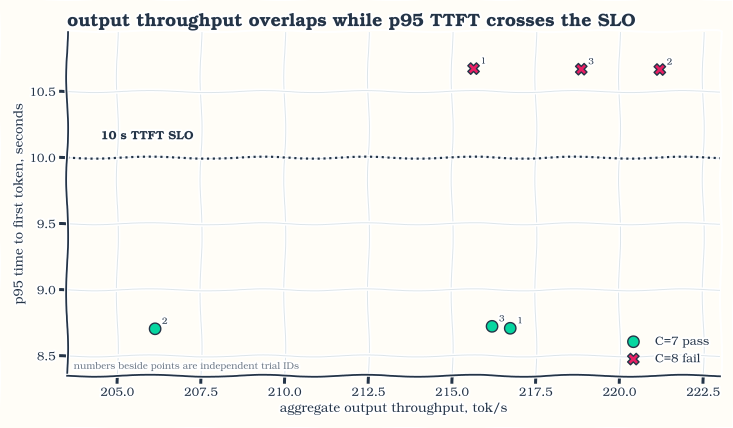
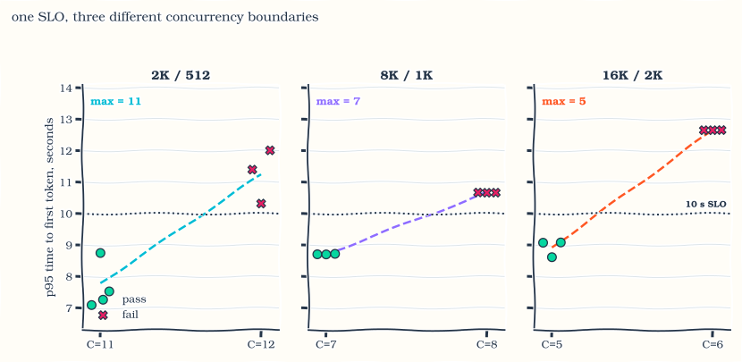
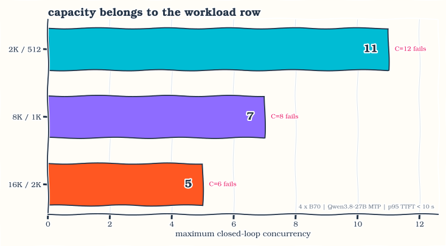
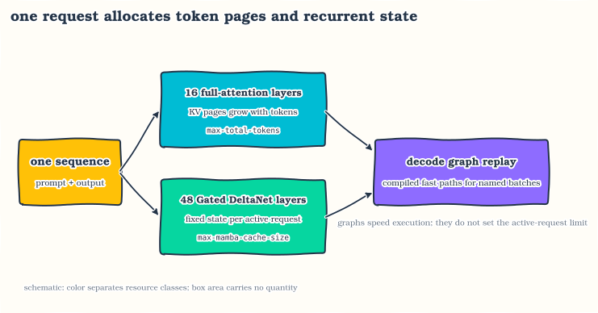
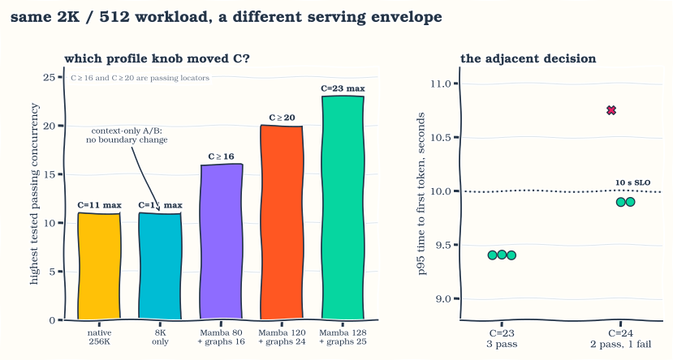
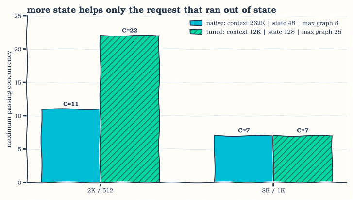
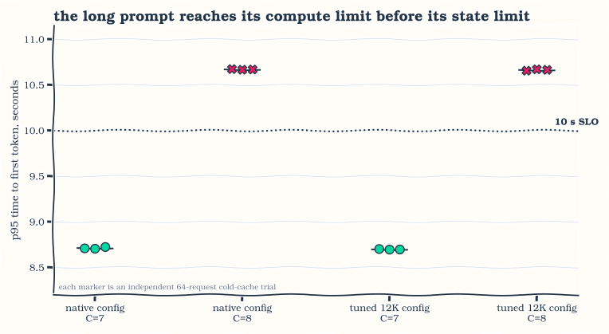
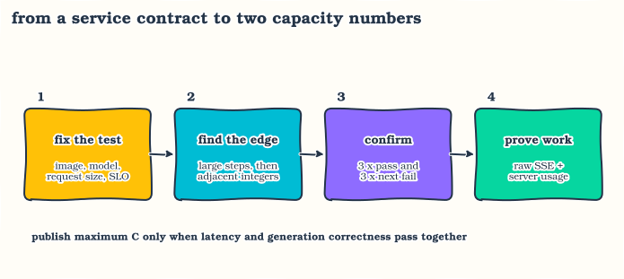

::: {.follow-up-note .capacity-summary}
> **Capacity at a glance:** I write request sizes as input/output tokens, so
> 2K/512 means 2,048 input tokens followed by 512 generated tokens.
>
> Maximum context is the largest prompt-plus-completion sequence the server
> accepts for one request. The native configuration used Qwen3.8's 262,144-token
> maximum, 48 recurrent-state entries for active hybrid-model sequences, and
> decode fast paths captured for batches 1, 2, 4, and 8. Four B70s supported 11
> concurrent 2K/512 requests, seven 8K/1K requests, or five 16K/2K requests.
>
> The tuned configuration kept storage for 262,144 active or cached tokens
> across requests, limited each request to 12,288 tokens, raised the
> recurrent-state pool to 128 entries, and captured nine decode fast paths,
> ending at batch 25. It supported 22 concurrent 2K/512 requests while the
> 8K/1K result stayed at seven. A 16K/2K request is longer than the
> 12,288-token per-request limit
> and does not fit.
>
> Each number is the largest tested concurrency whose 95th-percentile time to
> first token remained below ten seconds in all three confirmation trials. I
> also tested the next integer. The request sizes were measured separately, so
> the numbers are not meant to be added together. Below, I call the two setups
> the native configuration and the tuned 12K configuration.
:::

The awkward moment in capacity planning comes while the server still looks
healthy. All four GPUs are busy, aggregate token throughput is climbing, every
request eventually finishes, and the next user has already waited too long for
the first token. The machine has work left in it. The service has run out of
the kind of capacity it promised.

That happened with eight requests in flight on four Intel Arc Pro B70s running
Qwen3.8-27B. I used the model's multi-token-prediction head, or MTP, to draft
several tokens before the full model verified them. The single-request
benchmark looked excellent: the server read, or prefilled, an 8K prompt at
roughly 4,000 tok/s and streamed the completion near 104 tok/s. With eight
requests in flight, the server emitted more output tokens per second than it
did with seven, but 95th-percentile time to first token (p95 TTFT) crossed ten
seconds.

On the tuned 12K configuration, the capacity for my reference agent turn is
**seven concurrent 8K-input, 1K-output requests** under a service-level
objective (SLO) of p95 TTFT below ten seconds. I use `C` for client concurrency,
the number of requests AIPerf keeps in flight. Three independent C=7 trials
landed at 8.695, 8.697, and 8.702 seconds. Three C=8 trials landed at 10.656,
10.665, and 10.671 seconds.

For the shorter 2K/512 workload, the same server carried **22 concurrent
requests**. C=22 passed three times near 9.0 seconds. C=23 was mixed, with one
trial at 10.232 seconds, so I rejected it. The tuned server doubles
short-request capacity over the native configuration without changing the
seven-request 8K/1K result.

The 2K/512 and 8K/1K limits fail for different reasons. Short requests first
run out of active-sequence room, so the tuned configuration's larger
recurrent-state pool and larger captured decode batches let concurrency rise.
Long prompts spend the ten-second budget while the GPUs are still reading
their input, so the same configuration leaves their limit at seven.

The interesting question is why request twelve waited when eleven short
requests came nowhere near filling the token pool. The answer runs through the
model's recurrent state, four serving limits that sound deceptively similar,
and a raw-stream check to make sure AIPerf was counting real generated text.

## Part I: Run the exact server

### Resolve `latest` into an experimental identity

At the time of measurement, `latest` pointed to the Qwen3.8 build. Tags can
move, so the first command turns that tag into an immutable digest:

```bash
docker pull rahulunair/sglang-xpu:latest
docker image inspect rahulunair/sglang-xpu:latest \
  --format '{{index .RepoDigests 0}}'
```

The run resolved to:

```text
rahulunair/sglang-xpu@sha256:feb7b9130eff2fa26dfa09ab1a8b9a8423db013ad7d18f804f8b55a57cb2c175
```

I used
[`ulkaa/Qwen3.8-27B-AWQ-INT4`](https://huggingface.co/ulkaa/Qwen3.8-27B-AWQ-INT4)
at snapshot `2bf7f1646dc0875cff4404fdfef976cfb0ff2199`. This is the
native-context activation-aware weight-quantized (AWQ) W4A16 checkpoint:
four-bit weights and 16-bit activations. Its bfloat16 (BF16)
multi-token-prediction head supplies the speculative draft, so MTP does not
need a second model directory.

SGLang selects that worker with `--speculative-algorithm EAGLE`. In this
command, EAGLE is the runtime path that repeatedly calls Qwen3.8's built-in MTP
head. It does not mean a separate EAGLE draft model is being loaded.

The public
[`rahulunair/sglang-xpu` recipe](https://hub.docker.com/r/rahulunair/sglang-xpu#qwen38-27b)
is the starting point. The command below pins the resolved image and launches
the server with maximum context set to 12,288 tokens, the setting used for both
final workload measurements in this post.

```bash
export IMAGE='rahulunair/sglang-xpu@sha256:feb7b9130eff2fa26dfa09ab1a8b9a8423db013ad7d18f804f8b55a57cb2c175'
: "${MODEL_DIR:?set MODEL_DIR to the pinned checkpoint snapshot}"
: "${CONTAINER:?choose a local container name}"

SERVER_ARGS=(
  python -m sglang.launch_server
  --model-path /model --served-model-name Qwen3.8-27B
  --device xpu --tp-size 4 --host 0.0.0.0 --port 30000
  --trust-remote-code --attention-backend intel_xpu --page-size 64
  --context-length 12288 --max-total-tokens 262144
  --chunked-prefill-size 4096 --mem-fraction-static 0.85
  --max-running-requests 64 --max-mamba-cache-size 128
  --disable-custom-all-reduce --watchdog-timeout 1800
  --cuda-graph-config '{"decode":{"backend":"full","bs":[1,2,4,8,12,16,20,24,25]},"prefill":{"backend":"disabled"}}'
  --skip-server-warmup --language-only --enable-cache-report
  --reasoning-parser qwen3 --tool-call-parser qwen3_coder
  --strip-thinking-cache --enable-strict-thinking
  --speculative-algorithm EAGLE --speculative-num-steps 7
  --speculative-eagle-topk 1 --speculative-num-draft-tokens 8
)
```

```bash
docker run -d --name "$CONTAINER" \
  --device=/dev/dri -v /dev/dri:/dev/dri \
  --group-add video --group-add "$(getent group render | cut -d: -f3)" \
  --ipc=host --shm-size=64g \
  --cap-add=SYS_PTRACE --security-opt seccomp=unconfined \
  --ulimit memlock=-1 --ulimit stack=67108864 \
  -p 30000:30000 \
  -e ONEAPI_DEVICE_SELECTOR=level_zero:gpu \
  -e XPU_REPO=/opt/xpu \
  -e XPU_DENSE_INT8_MAX_M=8 \
  -e XPU_SYMM_AR_MAX_BYTES=131072 \
  -v "$MODEL_DIR:/model:ro" \
  "$IMAGE" "${SERVER_ARGS[@]}"
```

The host ran a CachyOS 7.2.0 kernel and Intel driver 17012946. Each B70
reported 32,656 MiB. With tensor parallelism set to four (TP4), SGLang placed
one model shard on each card. After allocating model and cache memory and
capturing reusable decode paths, the server reported 10.59 GB of free GPU
memory. It could hold 262,144 active or cached tokens across requests, and its
recurrent-state allocator could keep 25 requests active at once.

### Readiness should not become a warm-up

I checked ordinary health, the advertised model, the launch arguments, and the
final allocator line before load:

```bash
curl -fsS http://127.0.0.1:30000/health
curl -fsS http://127.0.0.1:30000/v1/models | jq
docker logs "$CONTAINER" 2>&1 | rg -m1 'server_args=ServerArgs'
docker logs "$CONTAINER" 2>&1 | rg 'max_total_num_tokens' | tail -1
```

`/health_generate` sends a generation request. That request has a prompt and a
cache footprint, and it may compile the execution path for that request size.
If I use it, it becomes part of the workload. Plain `/health` tells me the
process is ready without warming the path I am about to measure.

## Part II: Give capacity a workload and an SLO

### A fast single stream is only the starting point

The Docker Hub recipe begins with one request in flight (`C=1`), 8,192
synthetic input tokens, and 1,024 output tokens. I reproduced that benchmark
with AIPerf 0.10.0 before increasing concurrency:

```bash
aiperf profile \
  --model Qwen3.8-27B --url http://127.0.0.1:30000 \
  --endpoint-type chat --streaming \
  --tokenizer "$MODEL_DIR" --tokenizer-trust-remote-code \
  --isl 8192 --isl-stddev 0 --osl 1024 --osl-stddev 0 \
  --extra-inputs '{"temperature":0,"ignore_eos":true}' \
  --random-seed 42 --warmup-request-count 2 \
  --request-count 10 --concurrency 1 --export-level raw
```

In AIPerf, `ISL` is input sequence length and `OSL` is output sequence length.
TTFT measures the delay from sending a request to receiving its first streamed
token. A p50 value is the median across the measured requests. Inter-token
latency (ITL) measures the delay between later streamed tokens.

| C=1 metric | Docker Hub benchmark | this rerun |
|:---|---:|---:|
| TTFT p50 | 2.310 s | 2.133 s |
| TTFT-derived prefill | 3,546 tok/s | 3,840 tok/s |
| inter-token latency p50 | 9.03 ms | 9.619 ms |
| per-user decode | 110.7 tok/s | 104.0 tok/s |
| aggregate output throughput | 87.4 tok/s | 90.2 tok/s |

The rerun was close enough to show that the expected image, checkpoint,
attention backend, and MTP path were active. Nice result. Still not a capacity
number: it says nothing about the queue that forms when several prompts arrive
together.

A capacity number needs a complete workload definition. Input length decides
how much prompt-reading work arrives. Output length decides how long existing
requests keep generating. Cache state changes how much of a prompt the server
can reuse. The arrival pattern decides how many requests overlap.

### Define the workload before searching for maximum concurrency

My reference workload represents a substantial agent turn: 8K input, 1K
output, a fixed number of requests kept in flight, and a 95th-percentile
first-token limit below ten seconds. AIPerf calls that arrival pattern
closed-loop concurrency. Each time one request finishes, AIPerf starts another
so the selected concurrency remains in flight.

The radix cache can reuse a matching prompt prefix from an earlier request. I
left that production feature enabled, but flushed it before every independent
trial so one trial could not inherit useful prompt state from another.

| dimension | reference value |
|:---|:---|
| hardware | 4 x Intel Arc Pro B70, TP4 |
| model | Qwen3.8-27B AWQ W4A16 with MTP |
| configured input / output | 8,192 / 1,024 tokens, zero variance |
| server-visible prompt | 8,244 to 8,246 tokens after the chat template |
| sampling | temperature 0; ignore the end-of-sequence token so every request generates the full requested output |
| arrival | AIPerf closed loop at fixed concurrency |
| cache | radix enabled, flushed before each independent trial |
| warm-up | eight C=1 requests, excluded from metrics |
| measured sample | at least `max(64, 4 × C)` requests per trial |
| latency contract | p95 TTFT strictly below 10,000 ms |
| boundary rule | all three trials at C must pass; test C+1 beside it |
| correctness | HTTP 200, exact output length, non-empty streamed text |

For workload `w`, the measured limit is:

$$
C_{\max}(w) = \max \left\{C :
\operatorname{p95}(\mathrm{TTFT}) < 10\ \mathrm{s}
\text{ in every confirmation trial}\right\}.
$$

Now the number has one job: say how many requests this workload can keep in
flight under this latency promise. Changing the percentile creates a new
result. Every maximum-passing workload at the model's native 262,144-token
context exceeded ten seconds at p99, so none also passes a p99 version of the
same limit.

## Part III: Watch the tail break before throughput does

### At the native 262,144-token maximum, seven reference requests pass

I first measured the native-context Docker Hub configuration: 262,144 tokens
of maximum context, the same 262,144-token server-wide pool, 48 entries in
SGLang's recurrent-state cache, and fast decode paths captured for batches 1,
2, 4, and 8. These are four separate limits. They cannot be substituted for
one another.
I raised concurrency in large steps, then tested the integers between the last
pass and first failure. The 8K/1K limit landed at seven and eight.

| exploratory concurrency | TTFT p50 | TTFT p95 | TTFT p99 | output tok/s |
|---:|---:|---:|---:|---:|
| 4 | 2.161 s | 4.101 s | 7.862 s | 178.5 |
| 6 | 2.126 s | 6.737 s | 11.409 s | 197.5 |
| 7 | 2.131 s | 8.694 s | 13.399 s | 218.5 |
| 8 | 2.135 s | 10.660 s | 15.583 s | 217.0 |

Median TTFT barely moved. The slowest requests carried the queue, and p95 rose
by more than six seconds between C=4 and C=8. C=6 would pass this p95 contract
and fail the same ten-second limit at p99, the 99th percentile. Picking the
percentile after seeing the table would be picking the answer after the
experiment.

I launched a fresh AIPerf process for every trial. Before each one, I flushed
the server cache and generated a new prompt corpus and seed. Eight warm-up
requests were excluded, leaving 64 measured requests.

| C | TTFT p95, trial 1 | trial 2 | trial 3 | output tok/s range | verdict |
|---:|---:|---:|---:|---:|:---|
| **7** | **8.709 s** | **8.705 s** | **8.724 s** | 206.1 to 216.7 | pass |
| 8 | 10.674 s | 10.667 s | 10.669 s | 215.6 to 221.2 | fail |

The C=8 trials produced at least as much aggregate output as the C=7 trials.
The decoder remained productive while new prompts waited outside the SLO.

{fig-alt="Six 8K-input and 1K-output trials with server maximum context set to the native 262,144 tokens compare aggregate output throughput with p95 TTFT. Throughput overlaps at concurrency seven and eight, while every concurrency-seven trial stays below the 10-second SLO and every concurrency-eight trial crosses it."}

*Figure 1. Aggregate output throughput overlaps at C=7 and C=8; p95 TTFT separates every passing trial from every failure.*

Reading the points from left to right does not reveal a throughput cliff. The
vertical position carries the service failure. Peak tokens per second cannot
be divided by an input/output token pair to produce a concurrency limit.

### Three request sizes produce three native-context limits

The 8K/1K workload is my reference case. Two more workloads show how quickly a
single host-level answer falls apart.

| AIPerf input / output | server prompt range | maximum passing C | passing p95 TTFT, three trials | next C | adjacent p95 TTFT, three trials |
|:---|:---|---:|:---|---:|:---|
| 2,048 / 512 | 2,099 to 2,102 | **11** | 7.095, 8.751, 7.530 s | 12 | 11.402, 10.323, 12.015 s |
| 8,192 / 1,024 | 8,243 to 8,246 | **7** | 8.709, 8.705, 8.724 s | 8 | 10.674, 10.667, 10.669 s |
| 16,384 / 2,048 | 16,435 to 16,438 | **5** | 9.077, 8.617, 9.086 s | 6 | 12.656, 12.655, 12.660 s |

{fig-alt="Three panels show independent p95 TTFT trials with server maximum context set to the native 262,144 tokens. The workloads use 2K input and 512 output, 8K input and 1K output, and 16K input and 2K output. Every trial at the accepted concurrency is below ten seconds, and every adjacent trial is above it."}

*Figure 2. Each request size has an adjacent passing and failing concurrency, repeated three times on both sides.*

The 2K/512 workload has the noisiest passing side, spanning 1.656 seconds
across seeds. The verdict still holds in all three runs. The 8K/1K trials
happen to cluster within 19 ms, but that tidy repeatability is a property of
these trials, not permission to run one trial elsewhere.

{fig-alt="With server maximum context set to Qwen3.8's native 262,144 tokens, maximum closed-loop concurrency under the same 10-second p95 TTFT SLO is eleven for 2K input and 512 output, seven for 8K input and 1K output, and five for 16K input and 2K output."}

*Figure 3. With server maximum context at the native 262,144 tokens, request size moves maximum concurrency from eleven to seven to five.*

Longer input consumes the first-token budget directly. Longer output keeps
older requests in decode, so the next prompt arrives behind more resident
work. That second effect is easy to miss at C=1, where output length comes
after the only request has already received its first token.

The 2K/512 workload exposed another puzzle. Even eleven requests near their full
2,560-token input-plus-output length would fit well below the server's shared
262,144-token pool, yet capacity stopped at eleven concurrent requests. The
allocator had already printed the clue during startup: the requested 64 active
slots had been reduced to nine.

I tried the obvious explanation first. Perhaps a server configured to accept a
262,144-token request paid for that range even when every prompt contained only
2K tokens. Lowering maximum context alone changed nothing. That failed
experiment sent me back to the model and the allocator's nine-request warning.

## Part IV: Follow one request through Qwen3.8

### The model leaves two different kinds of memory behind

Qwen3.8-27B is dense, which means every token uses the same feed-forward
weights rather than selecting experts. It is also hybrid in how tokens share
information across a sequence. Of its 64 decoder layers, sixteen use full
attention and forty-eight use Gated DeltaNet, a linear-attention recurrence.
The checkpoint also contains the auxiliary MTP head used here to propose up to
eight tokens before the full model verifies them.

One request therefore creates two different persistent objects inside the
decoder:

1. Full-attention layers append key and value (KV) pages as tokens enter the
   sequence. More cached tokens require more KV pages.
2. Gated DeltaNet layers carry a recurrent state forward. Its shape is fixed
   for an active sequence, so a 2K request and an 8K request each need one
   sequence's state even though their prompt compute differs greatly.

SGLang manages the second object through its Mamba cache machinery. The flag
is named `max-mamba-cache-size` even though Qwen3.8's recurrent layers are
Gated DeltaNet. Here "Mamba" names the runtime state pool, not a claim that the
model architecture consists of Mamba blocks.

{fig-alt="A schematic follows one sequence into Qwen3.8. Sixteen full-attention layers create KV pages that grow with tokens and draw from max-total-tokens. Forty-eight Gated DeltaNet layers keep fixed recurrent state per active sequence and draw from max-mamba-cache-size. Both paths use captured decode graph batches, which speed repeated execution but do not determine how many requests the server can keep active."}

*Figure 4. Attention memory grows with tokens; recurrent memory grows with active sequences. Decode graphs provide captured fast paths for both kinds of state.*

The two branches meet again during decode. MTP proposes a block, the target
scores it, accepted tokens extend the sequence, and both attention KV and
recurrent state advance. Graph replay can make those repeated shapes cheaper,
but it does not turn a long prefill into a short one.

### Five recurrent entries become one active request

SGLang's radix cache can keep a reusable prompt prefix after a request ends.
In this pinned runtime, that cache starts with three recurrent-state entries
per request. While the scheduler overlaps prompt reading with generation, it
keeps two additional state buffers. The physical accounting is:

```text
recurrent entries per active request = 3 base + 2 overlap = 5
active request limit = floor(max_mamba_cache_size / 5)
```

That arithmetic reproduces every limit I observed:

| `max_mamba_cache_size` | physical calculation | runtime active limit |
|---:|:---|---:|
| 48 | floor(48 / 5) | 9 |
| 80 | floor(80 / 5) | 16 |
| 120 | floor(120 / 5) | 24 |
| 128 | floor(128 / 5) | 25 |

Client concurrency and active concurrency are different counters. AIPerf can
hold eleven requests in flight while the runtime executes nine and briefly
queues two. That arrangement passes if the waiting requests still receive their
first token before ten seconds. At C=12 with maximum context set to the native
262,144 tokens, enough requests wait long enough to break p95.

## Part V: Separate the flags that look interchangeable

### Each limit controls a different axis

Several SGLang flags contain a large token or request number. Their names make
them easy to collapse into one idea called "cache size." They control different
objects.

| flag | object controlled | what the value means in this experiment |
|:---|:---|:---|
| `--context-length 12288` | maximum length accepted for one request | prompt, chat-template overhead, and generated tokens must fit below 12,288 |
| `--max-total-tokens 262144` | token-page storage shared by the server | attention KV for active tokens and retained radix pages draw from this pool |
| `--max-running-requests 64` | requested scheduler ceiling | the runtime may lower it when another memory pool supports fewer active requests |
| `--max-mamba-cache-size 128` | physical recurrent-state entry pool | five entries per active request resolve to 25 active requests here |
| decode `bs=[...]` | captured execution shapes | listed decode batches use graph replay; the list sets neither token storage nor the active-request limit |

`context-length` is the input-and-output length check for one request. It does
not reserve 12,288 token slots for every request. A 2K request still uses roughly
2K prompt tokens plus its generated tokens. Lowering this value helps only when
the allocator can use the released range or memory for a resource that was
already limiting the server.

`max-total-tokens` is the page budget across the server. Keeping it at 262,144
lets many short sequences share a large physical pool. It also leaves room for
radix-cached prefixes. Shrinking the pool may free memory, but it cannot reduce
the matrix work in a prompt that is already being processed.

`max-running-requests` asks the scheduler for an upper bound. The number printed
after allocation is the one the runtime can physically keep active. The native
launch asked for 64 and resolved to nine because the 48-entry recurrent-state
pool held only nine sets of recurrent state.

`max-mamba-cache-size` sizes that recurrent-state pool. It scales with active
sequences rather than tokens in each sequence. Expanding this pool gave the
short workload room to move.

The graph list solves another problem. Capturing decode at batches 1, 2, 4,
and 8 gives those shapes a replay path without rebuilding the command stream
on every token. Extending the list to include 12, 16, 20, 24, and 25 keeps those
larger decode batches on the same path. A missing graph tier can fall back to a
slower execution path;
having a graph tier does not guarantee that its batch meets the latency SLO.
Prefill graphs remained disabled in every server setting here.

Two nearby settings complete the picture. `--chunked-prefill-size 4096`
breaks a long prompt into 4K chunks so prefill can share the scheduler with
decode work. It changes scheduling granularity, not the total amount of prompt
compute. `--page-size 64` sets the attention KV paging granularity. Neither one
was varied in this study.

### Why I set the server's maximum context to 12,288

An AIPerf `--isl 8192` message becomes 8,244 to 8,246 server prompt tokens
after the chat template. The server must then generate 1,024 tokens. A literal
8,192-token sequence ceiling cannot serve that request, even though it is
convenient to call the workload "8K/1K."

The final server setting uses 12,288 tokens:

```text
8,246 maximum observed prompt
+1,024 requested completion
------
9,270 required sequence tokens

12,288 sequence ceiling
-9,270 measured requirement
------
3,018 tokens of headroom at the largest observed prompt
```

The 12,288-token maximum holds both benchmark request sizes without allowing a
single request to grow to the model's native 262,144-token maximum. The
server-wide token-page storage stays at 262,144. Maximum context checks one
request. `max-total-tokens` supplies storage across all requests.

## Part VI: Follow the short-request tuning ladder

### Lowering maximum context alone leaves C=11 exactly where it was

The first A/B changed only `context-length`, lowering it from 262,144 to 8,192.
The token pool stayed at 262,144, the recurrent-state pool stayed at 48 entries,
and graph coverage still ended at batch eight.

C=11 passed three times. C=12 failed three times. Changing only maximum context
left the boundary in the same place because the nine-request recurrent-state
limit had not moved.

I then raised the recurrent-state pool to 80 entries and added a captured graph
for batch 16. C=16 passed at 7.197 to 7.220 seconds p95. Repeating C=16 with a
smaller 65,536-token pool produced 7.182, 7.190, and 8.231 seconds. The smaller
token pool saved space but did not buy capacity for that C=16 workload, so I
restored 262,144.

A 120-entry recurrent-state pool with batch 24 captured passed C=20. At 128
entries, the allocator resolved to 25 active requests; I captured batch 25 to
match it. With maximum context set to 8,192 tokens for this diagnostic run,
2K/512 passed C=23 three times and became mixed at C=24.

| server change | maximum context | token pool | recurrent entries | largest captured decode batch | measured result |
|:---|---:|---:|---:|---:|:---|
| native configuration | 262,144 | 262,144 | 48 | 8 | C=11 pass, C=12 fail |
| lower maximum context only | 8,192 | 262,144 | 48 | 8 | C=11 pass, C=12 fail |
| add recurrent state and graphs | 8,192 | 262,144 | 80 | 16 | C=16 passes |
| smaller token-pool A/B | 8,192 | 65,536 | 80 | 16 | C=16 passes, no gain |
| add recurrent state and graphs | 8,192 | 262,144 | 120 | 24 | C=20 passes |
| measure the 8,192-token limit | 8,192 | 262,144 | 128 | 25 | C=23 pass, C=24 mixed |
| fit both final request sizes | 12,288 | 262,144 | 128 | 25 | C=22 pass, C=23 mixed |

{fig-alt="For the same 2K-input and 512-output workload, lowering only the server's maximum context leaves maximum concurrency at eleven. Larger recurrent-state pools with matching graph tiers produce passing steps at sixteen and twenty. With maximum context at 8,192 tokens, C=23 passes and C=24 is mixed. With maximum context at 12,288 tokens, all three C=22 trials pass while C=23 has two passes and one failure."}

*Figure 5. Maximum context alone changes nothing. Recurrent-state capacity and captured batch reach move the short workload; the tuned 12K configuration settles at C=22.*

With the larger recurrent-state pool and graph coverage in place, the
8,192-token diagnostic configuration reached C=23 for short requests. It could
not serve the reference workload because 8K input plus template tokens and 1K
output do not fit inside an 8K sequence.

The tuned run sets maximum context to 12,288 tokens, keeps the 128-entry
recurrent pool and largest captured decode batch of 25, and fits the full
reference request. Both workloads can now use the same continuously running
server.

## Part VII: Build one server configuration for both workloads

### The tuned 12K configuration carries 22 short requests

The final server used the exact command from Part I. For 2K/512, each C=22
trial contained 88 measured requests. Each C=23 trial contained 92.

| C | TTFT p95, trial 1 | trial 2 | trial 3 | TTFT p50 range | output tok/s range | verdict |
|---:|---:|---:|---:|---:|---:|:---|
| **22** | **8.988 s** | **8.998 s** | **8.988 s** | 0.690 to 0.918 s | 438.8 to 441.4 | pass |
| 23 | 10.232 s | 9.401 s | 9.400 s | 0.688 to 0.915 s | 421.4 to 447.6 | mixed, reject |

The C=23 median remained below one second in every trial. The slowest requests
still pushed p95 over the line. A median or a single lucky seed would have
produced the wrong concurrency limit.

The accepted capacity is C=22. Compared with C=11 on the native configuration,
the same hardware now handles twice as many short requests under the same SLO.

### The same server still carries seven 8K requests

I kept the server running and changed only the AIPerf workload to 8K/1K. Every
trial used 64 measured requests.

| C | TTFT p95, trial 1 | trial 2 | trial 3 | ITL p50 range | output tok/s range | verdict |
|---:|---:|---:|---:|---:|---:|:---|
| **7** | **8.702 s** | **8.695 s** | **8.697 s** | 29.820 to 30.707 ms | 210.1 to 212.3 | pass |
| 8 | 10.656 s | 10.671 s | 10.665 s | 32.218 to 33.787 ms | 216.5 to 223.6 | fail |

On the tuned 12K configuration, the two workload limits sit side by side:

{fig-alt="Grouped bars compare the native configuration, with 262,144-token maximum context, 48 recurrent-state entries, and a largest captured decode batch of eight, against the tuned configuration, with 12,288-token maximum context, 128 recurrent-state entries, and a largest captured batch of 25. For 2K input and 512 output, maximum concurrency rises from 11 to 22. For 8K input and 1K output, both configurations remain at seven."}

*Figure 6. The complete tuned 12K configuration doubles short-request capacity and preserves the seven-request 8K/1K limit.*

The short-request result moved only after recurrent-state capacity and graph
coverage moved with it. Lowering maximum context alone had already failed. The
same tuned configuration changes nothing for a request that spends the
first-token budget reading its prompt.

### The 8K prompt spends ten seconds before memory fills

The native configuration exposes nine active recurrent-state slots. The failing
8K/1K test is C=8, so all eight requests can already be active. Its decode
graphs also reach batch eight. Raising the recurrent pool to 128 entries and
capturing batches as large as 25 provides capacity this request size never
reaches.

The matched trials make that visible. On the native configuration, C=7 measured
8.705 to 8.724 seconds at p95; on the tuned 12K configuration it measured
8.695 to 8.702. Native C=8 measured 10.667 to 10.674; tuned C=8 measured
10.656 to 10.671.

{fig-alt="Four groups compare the native and tuned 12K server configurations for 8K input and 1K output. Both configurations pass all three concurrency-seven trials near 8.7 seconds p95 TTFT and fail all three concurrency-eight trials near 10.67 seconds."}

*Figure 7. The native and tuned 12K configurations land on the same 8K/1K limit, with nearly identical latency in every trial.*

Reading the eighth 8K prompt crosses the ten-second budget. Increasing
recurrent slots cannot reduce the matrix multiplications required to read that
prompt, and decode graph capture does not cover prompt processing in this
setup. Compute and scheduling run out of time before recurrent-state storage
fills.

The short request reaches the fixed state ceiling first, so increasing that
pool and capturing the larger decode batches lets C move. The long request
spends the TTFT budget reading the prompt first, so the complete tuned
configuration leaves C at seven.

## Part VIII: Make every counted token prove itself

### Server token usage and streamed text must agree

An early C=8 probe reported one completion as 979 tokens when the client
converted the reconstructed text back into tokens. The stream ended with
`finish_reason="length"`, and the server's usage object reported 1,024 tokens.
Converting text back to tokens does not always reverse the server's tokenizer
exactly, so the boundary runs use AIPerf's `--use-server-token-count`.

Server usage alone leaves another loophole. A broken endpoint could return
plausible counters without streaming generated text. I parsed every raw
Server-Sent Events (SSE) record and required:

1. The expected number of measured records is present.
2. Warm-up prompts are unique and absent from the measured set.
3. Every measured prompt is unique inside its trial.
4. Every response returns HTTP 200 and is not cancelled.
5. Every stream contains non-empty `reasoning_content` or `content` deltas.
6. Every final usage object reports the requested completion length.
7. Every request ends with `finish_reason="length"`.
8. Aggregate errors and output-length mismatches are zero.

The retained tuned-configuration results contain twelve trials: two request
sizes, the passing and adjacent concurrency for each size, and three trials at
each concurrency. Together they contain:

| generation check | total |
|:---|---:|
| measured HTTP 200 streams | 924 |
| exact server-counted completion tokens | 669,696 |
| non-empty generated-text chunks | 172,311 |
| generated UTF-8 bytes | 2,652,636 |
| errors, cancellations, length mismatches | 0 |
| streams finishing because they reached requested length | 924 |

I also decoded and read samples from the raw streams. They were continuous
model generations over the synthetic source text, not acknowledgements from
the load generator. Output hashes were unique within each trial.

Generation correctness is part of the capacity test. A latency result is
discarded if the server shortens, cancels, errors, or fabricates the work that
made it appear fast.

## Part IX: Repeat the boundary search with AIPerf

### Let AIPerf locate the concurrency edge

In AIPerf 0.10.0, automatic concurrency tuning is exposed through the
`max-concurrency-under-sla` profile search recipe. It finds the range between
the last passing concurrency and the first failure:

Set `SEARCH_OUT` to the directory where AIPerf should write this exploratory
search. The server command is the tuned 12K configuration defined in Part I.

```bash
aiperf profile \
  --model Qwen3.8-27B --url http://127.0.0.1:30000 \
  --endpoint-type chat --streaming --use-server-token-count \
  --tokenizer "$MODEL_DIR" --tokenizer-trust-remote-code \
  --request-timeout-seconds 21600 \
  --isl 8192 --isl-stddev 0 --osl 1024 --osl-stddev 0 \
  --extra-inputs '{"temperature":0,"ignore_eos":true}' \
  --random-seed 42 --num-dataset-entries 72 \
  --warmup-request-count 8 --warmup-concurrency 1 \
  --request-count 64 --search-recipe max-concurrency-under-sla \
  --ttft-sla-ms 10000 --concurrency-min 1 --concurrency-max 64 \
  --search-style monotonic --num-profile-runs 1 \
  --export-level records --artifact-dir "$SEARCH_OUT" \
  --ui simple --max-workers 64
```

Search points can share more server history than I want in a final claim,
especially when the prompt generator cycles through its dataset or the radix
cache retains prefixes. I use the search to find adjacent integers, then move
each confirmation into a separate process.

### Confirm both sides from clean state

This template runs one concurrency trial. Set the input length (`ISL`), output
length (`OSL`), concurrency (`C`), measured request count (`REQUESTS`), random
seed (`SEED`), and output directory (`OUT`) for each independent run:

```bash
curl -fsS -X POST http://127.0.0.1:30000/flush_cache
curl -fsS http://127.0.0.1:30000/health

aiperf profile \
  --model Qwen3.8-27B --url http://127.0.0.1:30000 \
  --endpoint-type chat --streaming --use-server-token-count \
  --tokenizer "$MODEL_DIR" --tokenizer-trust-remote-code \
  --request-timeout-seconds 21600 \
  --isl "$ISL" --isl-stddev 0 --osl "$OSL" --osl-stddev 0 \
  --extra-inputs '{"temperature":0,"ignore_eos":true}' \
  --random-seed "$SEED" \
  --num-dataset-entries "$((REQUESTS + 8))" \
  --warmup-request-count 8 --warmup-concurrency 1 \
  --request-count "$REQUESTS" --concurrency "$C" \
  --export-level raw --artifact-dir "$OUT" --ui None \
  --max-workers "$REQUESTS"
```

I use at least `max(64, 4 × C)` measured requests. With 64 requests, p95 is
sensitive to roughly the slowest four, exactly where a waiting group becomes
visible. Three separate processes give prompt order, speculative acceptance,
and scheduler timing three chances to move those slow requests.

Every trial at the claimed maximum concurrency must stay below the line. I
measure the next integer beside it. If that next value is mixed, as it was for
the short workload on the tuned 12K configuration, I reject it rather than
averaging it into a pass.

{fig-alt="A four-stage capacity protocol resolves the serving identity and workload, locates the range between passing and failing concurrency, confirms the adjacent integers with three independent cold-cache trials, then validates raw generated text and server token usage."}

*Figure 8. Search locates the edge; independent adjacent trials and raw generation checks establish the capacity result.*

The machine-readable metrics for the three request sizes on the native
configuration are in
[capacity-data.json](qwen38-capacity-planning/capacity-data.json). The
server-setting experiments are in
[short-workload tuning data](qwen38-capacity-planning/short-profile-data.json).
The final confirmations are in the
[tuned 12K short-workload trials](qwen38-capacity-planning/shared12k-short-data.json)
and
[tuned 12K reference-workload trials](qwen38-capacity-planning/shared12k-reference-data.json).

## Part X: Turn the measurements into a request limit

### The answer depends on request size

For four B70s running these pinned Qwen3.8 configurations with MTP, the table
below gives the largest concurrency where p95 first-token latency remained
below ten seconds in all three trials. Each request size was measured
separately.

| server configuration | maximum context | recurrent entries | largest captured decode batch | 2K/512 | 8K/1K | 16K/2K |
|:---|---:|---:|---:|---:|---:|---:|
| native | 262,144 | 48 | 8 | C=11 | **C=7** | C=5 |
| tuned 12K | 12,288 | 128 | 25 | **C=22** | **C=7** | request does not fit |

For a queue containing only 8K/1K requests, the measured ceiling is seven on
either server configuration. For a short-only 2K/512 queue
that does not need requests longer than 12,288 tokens, the measured ceiling is
22 on the tuned configuration. Neither number is yet a production limit for a
queue that mixes the two request sizes.

The three values on the native configuration are alternatives, not quantities
to add. I measured each request size in its own queue. A real queue mixing short
and long requests may behave differently because long prompts can delay short
ones. The next production experiment should replay input and output lengths
from real traffic, preserve whether a request reused a cached prefix and
whether it called tools, then measure one total concurrency limit for the mix.

Until that replay exists, these fixed request sizes are useful repeatable tests
and ceilings for separate homogeneous queues. A mixed queue needs one limit
measured from the joint traffic distribution.

An operating limit should sit below the measured maximum. Rolling deploys,
traffic drift, telemetry, driver variance, and a week of requests cover more
conditions than three benchmark trials. For either homogeneous workload, I
would begin one request below its measured edge, watch live p95 first-token
latency and queue depth, and raise it only after production traffic shows the
same margin. That safety margin is an operating decision, not another benchmark
result.

The roughly 4,000 tok/s prompt-reading number near the top is still useful. It
says one request is fast. It does not say how many overlapping requests remain
fast enough. On this host, the 8K/1K workload spends the first-token budget at
seven concurrent requests, before recurrent-state storage fills. The 2K/512
workload reaches that storage limit later, at 22 on the tuned configuration.
Those numbers, each tied to its request size, exact server configuration, and
the same ten-second limit, are the capacity answer.
